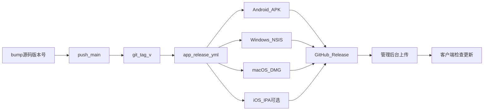

# GitHub 自动打包与密钥配置说明

> **仓库**：`vpn-client`（客户端独立仓；控制面 `vpn` 仓不跑客户端发版）  
> **用途**：Tag 触发自动打包、GitHub Secrets、版本 bump、产物核对、后台发布、**发版铁律与踩坑**  
> **最后更新**：2026-08-08  
> **当前版本线**：`1.2.8` / code `128`（以 `apps/tauri` 为准）  
> **Workflow**：[`app-release.yml`](../../.github/workflows/app-release.yml) · 门禁 [`tauri-ci.yml`](../../.github/workflows/tauri-ci.yml)  
> **密钥短表**：[`.github/GitHub发版密钥说明.md`](../../.github/GitHub发版密钥说明.md)  
> **本机备忘模板**：复制 [`.github/GitHub发版密钥本机备忘模板.md`](../../.github/GitHub发版密钥本机备忘模板.md) → `.github/GitHub发版密钥本机备忘.md`（已 gitignore，勿提交）  
> **PRD**：[客户端CI自动发包产品需求.md](../product/客户端CI自动发包产品需求.md)

> 旧文件名已废弃删除；请以本手册与 [`.github/GitHub发版密钥说明.md`](../../.github/GitHub发版密钥说明.md) 为准。

---

## 0. 发版铁律（先看再打 Tag）

### 0.1 必须遵守

| # | 规则 | 说明 |
|---|------|------|
| 1 | **只改 `apps/tauri`（+ 文档）发版** | `apps/android` **已存档**；仅保留 `mihomo-core` JNI 给 Tauri 链接 |
| 2 | **版本必须完整 semver `X.Y.Z`** | `tauri.conf.json` / `package.json` / `Cargo.toml` **禁止**写 `1.2`（会直接 cargo/CI 挂） |
| 3 | **四处版本一起 bump** | `app-meta.ts`（NAME+CODE）、`package.json`、`tauri.conf.json`、`Cargo.toml`；iOS 再改 `platforms/ios/project.yml` |
| 4 | **`APP_VERSION_CODE` 只增不减** | 后台/升级比较依赖整数码 |
| 5 | **只有 push `v*` Tag 才正式发包** | push main 只跑 `tauri-ci` 门禁，不出 GitHub Release |
| 6 | **Android minSdk ≥ 26** | `tauri.conf.json` → `bundle.android.minSdkVersion`（`mihomo-core` 要求 26） |
| 7 | **桌面/Android 共用 Secrets** | 至少配齐 Android 密码三项 + `VITE_API_BASE_URL`；要应用内更新再配 `TAURI_SIGNING_*` |
| 8 | **产物体积先过眼** | Android ~49MB；Win ~10–15MB；过小 = 缺 mihomo/native，**禁止分发** |

### 0.2 推荐发版步骤（复制即用）

```bash
# 1) 已在 apps/tauri 改完版本并 commit + push main
cd apps/tauri && npm test

# 2) 打 Tag（与 package.json version 对齐，带 v 前缀）
cd ../..
git tag v1.2.8
git push origin v1.2.8

# 3) GitHub → Actions → App Release 全绿后
#    Releases 下载 APK / NSIS / DMG（及 .sig）→ 管理后台上传
```

### 0.3 CI 两条线别搞混

| Workflow | 触发 | 目的 |
|----------|------|------|
| **Tauri Desktop CI**（`tauri-ci.yml`） | push/PR 改 `apps/tauri` | 门禁：前端测试、`cargo check`、桌面 smoke；**不发 Release** |
| **App Release**（`app-release.yml`） | push Tag `v*` | 正式包：Android APK + Win + Mac + 可选 iOS → GitHub Release |

Node.js 20 deprecated / Homebrew tap 警告可忽略，不是失败原因。

---

## 1. 一句话结论

**不会每次 push 就打包。** 只有把 **`v*` Tag 推到本仓库 GitHub**，才会跑 **App Release**，产出：

- Android 全量 APK（Tauri Vue + 存档 `mihomo-core`）  
- Windows NSIS 安装包  
- macOS DMG  
- （可选）iPhone IPA —— 需配齐 Apple 相关 Secrets  

并挂到 GitHub Release。再由人下载后上传到管理后台发布。

```text
改代码 → bump 各端版本号（semver） → push main → git tag vX.Y.Z → push tag
  → Actions 打包 → Releases 下载 → 管理后台上传发布
```

---

## 2. 流程总览



| 阶段 | 做什么 | 谁做 |
|------|--------|------|
| 开发 | PR / push → `tauri-ci`（测试，**不发版**）；`android-ci` 已存档停用 | CI |
| 改版本 | 改 `apps/tauri` `APP_VERSION_*`（三处 + Cargo）并 commit | 人 |
| 触发发版 | `git tag` + `git push origin <tag>` | 人 |
| 自动打包 | Actions：Android（Tauri）+ Win + Mac + 可选 iOS | CI |
| 运营发布 | 下载附件 → 后台上传 → 发布 | 人 |

---

## 3. 当前版本对照（以源码为准）

> Tag（如 `v1.2.8`）是发版列车号；用户看到的版本以各端源码为准。下表按 **2026-08-08** 核对。

| 端 | 用户可见版本 | 版本码 | 改哪里 |
|----|--------------|--------|--------|
| **Android / Windows / macOS / Linux** | `1.2.8` | `128` | **统一**：`apps/tauri/package.json`、`src-tauri/tauri.conf.json`、`src/lib/app-meta.ts`；`Cargo.toml` 一并 |
| **iPhone** | `1.2.8` | `128` | `apps/tauri/platforms/ios/project.yml` |
| **发版 Tag** | `v1.2.8` | — | 仅 Git Tag |

> **`apps/android` 已存档**：不再改其 `build.gradle.kts` 发版。CI Android APK 来自 `apps/tauri`。

---

## 4. GitHub Secrets（你配置过的那些）

配置位置：**本仓库** GitHub → Settings → Secrets and variables → Actions → Repository secrets。

**安全**：真实密码 / 私钥 / Base64 **不要写进已跟踪文件**。本机备忘只写到 gitignore 的 `GitHub发版密钥本机备忘.md`。

### 4.1 你已在用的 7 项（必看）

| Secret 名 | 中文含义 | 干什么用 | 本机对照 |
|-----------|----------|----------|----------|
| `ANDROID_KEYSTORE_BASE64` | Android 签名证书（Base64） | CI 还原 `.keystore`（备份路径） | 存档 `apps/android/keystore/kuayun-release.keystore` |
| `ANDROID_KEYSTORE_PASSWORD` | keystore 打开密码 | 解开证书库 | `keystore.properties` → `storePassword` |
| `ANDROID_KEY_ALIAS` | 密钥别名 | 指定用哪一把钥匙（常为 `key0`） | `keystore.properties` → `keyAlias` |
| `ANDROID_KEY_PASSWORD` | 密钥密码 | 使用该钥匙时的密码 | `keystore.properties` → `keyPassword` |
| `VITE_API_BASE_URL` | 正式包 API 根地址 | 打进 Win/Mac/**Android**（**不含 `/v1`**） | 例：`http://192.229.87.112:44080/api` |
| `TAURI_SIGNING_PRIVATE_KEY` | 桌面更新私钥全文 | 给安装包生成 `.sig` | `apps/tauri/.tauri/updater.key` |
| `TAURI_SIGNING_PRIVATE_KEY_PASSWORD` | 更新私钥密码 | 解开 updater 私钥 | `apps/tauri/.tauri/updater.key.password` |

说明：

- **Android 签名优先级**（`setup-android-signing.sh`）：  
  1) 仓库内已有 `keystore.properties` + `.keystore` → 直接用  
  2) 仅有入库 `.keystore` + 密码三项 Secrets → 自动写 properties（**推荐现状**）  
  3) 完整 `ANDROID_KEYSTORE_BASE64` + 密码 → 解码覆盖  
- **`VITE_API_BASE_URL`**：打进 **桌面 + Tauri Android**；改后必须重新打 Tag。  
- **Tauri 两项**：不配也能出安装包，但 **没有 `.sig`**，后台做不了应用内更新。**禁止**随意 `setup:updater -Force` 换密钥。  
- CI / 门禁无 updater 私钥时，`prepare-tauri-release-build.mjs` 会关闭 `createUpdaterArtifacts`（避免桌面构建收尾失败）。

### 4.2 可选：Apple / iOS（未配则跳过 IPA）

| Secret | 用途 |
|--------|------|
| `APPLE_CERTIFICATE_BASE64` | Distribution 证书 `.p12` 的 Base64 |
| `APPLE_CERTIFICATE_PASSWORD` | 导出 p12 时的密码 |
| `APPLE_PROVISIONING_PROFILE_APP_BASE64` | 主 App 描述文件 |
| `APPLE_PROVISIONING_PROFILE_TUNNEL_BASE64` | PacketTunnel 描述文件 |
| `APPLE_TEAM_ID` | Team ID（10 位） |
| `KEYCHAIN_PASSWORD` | CI 临时钥匙串密码（自设） |
| `IOS_EXPORT_METHOD` | `app-store`（默认）或 `ad-hoc` |
| `APPLE_SIGNING_IDENTITY` | macOS 桌面 Developer ID；空则 ad-hoc |

未配齐时 **不阻塞** Android / Windows / macOS。

### 4.3 把本机文件拷进 Secrets（PowerShell）

```powershell
# 在 vpn-client 仓库根目录执行

# Android keystore → ANDROID_KEYSTORE_BASE64
[Convert]::ToBase64String([IO.File]::ReadAllBytes("$PWD\apps\android\keystore\kuayun-release.keystore")) | Set-Clipboard

# Tauri updater 私钥 → TAURI_SIGNING_PRIVATE_KEY
Get-Content "$PWD\apps\tauri\.tauri\updater.key" -Raw | Set-Clipboard

# Tauri updater 密码 → TAURI_SIGNING_PRIVATE_KEY_PASSWORD
Get-Content "$PWD\apps\tauri\.tauri\updater.key.password" -Raw | Set-Clipboard
```

密码 / 别名从本机 `apps/android/keystore.properties` 手抄到 Secrets（该文件在 `.gitignore`，不会提交）。

---

## 5. 如何发一个新版本

### 5.1 发 Android（与桌面同一版本源）

1. 改 `apps/tauri` 版本四处 + `APP_VERSION_CODE` **必须 +1**（见 §3）  
2. 确认 `bundle.android.minSdkVersion >= 26`  
3. 确认 Android 签名 Secrets / 入库 keystore 可用  
4. 确认 `VITE_API_BASE_URL` 指向生产控制面  
5. commit → push main → 打 Tag（§5.4）  
6. 下载 `kuayun-android-*-arm64.apk` → 后台 `platform=android` 上传  

> 勿再改 `apps/android`（已存档）。本机也可：`cd apps/tauri && npm run tauri:android:build:release`

### 5.2 只发 Windows / macOS

1. 四处版本改成同一组（如 `1.2.8` / `128` → `1.2.9` / `129`）  
2. `APP_VERSION_CODE` **只增不减**  
3. commit → push → Tag  
4. 下载 `.exe` / `.dmg`，有应用内更新再带上对应 `.sig`  

### 5.3 两端一起发

两端都 bump 后打一次 Tag，Actions 并行构建。

### 5.4 打 Tag

```bash
git pull origin main
git tag v1.2.8
git push origin v1.2.8
```

| 规则 | 说明 |
|------|------|
| 格式 | 必须以 `v` 开头 |
| 触发 | **push tag**；只改代码不打 Tag = 不发版 |
| 进度 | GitHub → Actions → **App Release** |
| 下包 | GitHub → Releases → 对应 Tag |

---

## 6. 打出来的包长什么样

| 附件 | 正常体积 | 含义 |
|------|----------|------|
| `kuayun-android-{name}-{code}-arm64.apk` | **~49MB** | 全量（含 libclash / libbridge）；CI 从 `universal` 或 `arm64` APK 收集后重签名 |
| `kuayun-windows-{ver}-x64-setup.exe` | **~10–15MB** | 含 mihomo |
| `kuayun-macos-{ver}.dmg` | **~15–20MB** | 含 mihomo |
| `*.sig` | 很小 | Updater 签名（需 `TAURI_SIGNING_*`） |
| `kuayun-ios-*.ipa` | — | 仅 Apple Secrets 齐全时 |

异常：Android ~2.5MB、Windows ~3.6MB → 缺内核，**不要分发**。

---

## 7. 管理后台发布

### Android

- 平台 `android`；版本名/码与 APK 一致；上传 APK（无 Updater 签名字段）

### Windows / macOS（应用内更新）

| 字段 | 填什么 |
|------|--------|
| 平台 | `windows` / `macos` |
| 版本名 / 版本码 | 与包一致；码须大于用户当前 |
| 安装包 | `.exe` / `.dmg` |
| Updater 签名 | 对应 **`.sig` 全文**（不是 SHA256） |

自测：

```text
GET {API}/api/v1/client/version/tauri-manifest?target=windows-x86_64&current_version=1.1.0
GET {API}/api/v1/client/version/tauri-manifest?target=darwin-aarch64&current_version=1.1.0
```

应返回带 `signature` + `url` 的 JSON。

---

## 8. 注意事项

1. **Tag 才发包**，push main 不会出正式 Release。  
2. **版本码只增不减**；同平台后台不可重复。  
3. **桌面/Android 版本以 `apps/tauri` 四处为准，必须一致**；且为完整 semver。  
4. CI 已自动拉 mihomo；Android 依赖存档 `mihomo-core` JNI；勿用瘦包当默认渠道。  
5. Updater 密钥一对一生；丢私钥 = 无法再签同系列更新。  
6. macOS 无 Developer ID 时为 ad-hoc，用户可能要在「隐私与安全性」允许。  
7. **`VITE_API_BASE_URL`** 影响桌面与 Tauri Android；改后必须重新打 Tag。  
8. Secrets 配在 **vpn-client** 仓（不要只留在旧 `vpn` 仓）。  
9. **`apps/android` 已存档**，勿再按其 Compose 工程发版。  
10. Rust **桌面专用 API**（tray / updater / splash 窗口）须 `#[cfg(desktop)]`，否则 Android 编译挂。  
11. Linux 路径用 Rust 风格 `is_empty()`，不要写 JS/Kotlin 的 `isEmpty()`。

---

## 9. Android CI 踩坑清单（已踩过，勿再犯）

> 构建链：`app-release` → `build-tauri-android-release.sh` → `tauri android init` → `sync-android-vpn.sh` → `tauri android build` → 找 APK → 签名上传。

| 现象 | 根因 | 正确做法（已落入代码） |
|------|------|------------------------|
| `version must be a semver string` | `tauri.conf` 写了 `1.2` | 必须 `1.2.8` 这种 `X.Y.Z` |
| `@shared/theme/tokens` 解析失败 | 拆仓后缺 `frontend/shared` | 仓库须跟踪 `frontend/shared` |
| 签名秒挂 | 只有入库 keystore、无 properties、无密码 Secrets | 配 `ANDROID_KEYSTORE_PASSWORD` / `ALIAS` / `KEY_PASSWORD` |
| `:mihomo-core` could not be found | sync 只改了 `settings.gradle.kts`，Tauri 实际用 **`settings.gradle`** | `sync-android-vpn` 两边都 patch |
| `kotlin.plugin.serialization` not found | gen 根工程未声明插件版本 | sync 注入 `build.gradle.kts` + `settings.gradle` |
| Manifest merger minSdk | 默认 minSdk 24 &lt; mihomo-core 26 | `bundle.android.minSdkVersion: 26` + sync 兜底 |
| `release APK not found`（但日志已 Finished APK） | 产物名是 `universal-*-unsigned.apk`，脚本只找 `arm64` | 收集脚本兼容 universal/arm64 |
| tray/menu unresolved on Android | 桌面 API 未门控 | `#[cfg(desktop)]` + 移动端 stub |
| Linux `cargo check` / deb 挂 | `detail.isEmpty()` | 改为 `is_empty()` |
| 桌面 CI smoke 挂、Release Win/Mac 绿 | CI 无 updater 私钥仍开 `createUpdaterArtifacts` | `prepare-tauri-release-build.mjs` |
| iPhone Simulator exit 65 | NE 无签名 | `tauri-ci` 只做 xcodegen；正式 IPA 走 App Release |

**关键脚本**：

| 脚本 | 职责 |
|------|------|
| `scripts/ci/build-tauri-android-release.sh` | init → sync → build → 找 APK → 签名 → 体积/so 校验 |
| `apps/tauri/scripts/sync-android-vpn.sh` | overlay → gen；include `:mihomo-core`；serialization；minSdk |
| `scripts/ci/setup-android-signing.sh` | keystore / Secrets → `keystore.properties` |
| `scripts/ci/prepare-tauri-release-build.mjs` | 无私钥时关 updater 产物；Mac ad-hoc |

---

## 10. 推荐命令

```bash
# 1. 已 bump apps/tauri 版本并 push 到 main
# 2. 可选本地门禁
cd apps/tauri && npm test && npm run preflight:desktop

# 3. 打 Tag（与当前 version 对齐）
cd ../..
git tag v1.2.8
git push origin v1.2.8

# 4. Actions / Releases 核对体积与 .sig → 后台上传
```

---

## 11. 相关文件

| 文件 | 说明 |
|------|------|
| `.github/workflows/app-release.yml` | Tag 发版（Android=Tauri + Win + Mac + 可选 iOS） |
| `.github/workflows/tauri-ci.yml` | PR/push 门禁（不发版） |
| `.github/workflows/android-ci.yml` | **已存档**（仅手动提醒） |
| `.github/GitHub发版密钥说明.md` | Secrets 短说明 |
| `.github/GitHub发版密钥本机备忘模板.md` | 本机备忘模板 |
| `scripts/ci/build-tauri-android-release.sh` | Tag CI 打 Tauri Android APK |
| `scripts/ci/setup-android-signing.sh` | Android 签名注入 |
| `scripts/ci/prepare-tauri-release-build.mjs` | 无 updater 密钥时关签名产物 |
| `apps/tauri/scripts/sync-android-vpn.sh` | VPN overlay + mihomo-core + minSdk/serialization |
| [`apps/android/ARCHIVE.md`](../../apps/android/ARCHIVE.md) | Android Compose 存档说明 |
| [`apps/tauri/跨云客户端打包说明.md`](../../apps/tauri/跨云客户端打包说明.md) | 本机桌面 / Android / Updater |
| [`App-Android-发版检查清单.md`](App-Android-发版检查清单.md) | Android 上架前核对 |
