# GitHub 自动打包�密钥�置说�
> **仓库**：`vpn-client`（客户端独立仓；�制�`vpn` 仓�跑客户端�版� 
> **用�*：Tag 触�自动打包�GitHub Secrets�版�bump�产物核对����布�*�版�律�踩�*  
> **最�更�*�026-08-08  
> **当�版本�*：`1.2.10` / code `130`（以 `apps/tauri` 为准� 
> **Workflow**：[`app-release.yml`](../../.github/workflows/app-release.yml) · 门� [`tauri-ci.yml`](../../.github/workflows/tauri-ci.yml)  
> **密钥短表**：[`.github/GitHub�版密钥说�.md`](../../.github/GitHub�版密钥说�.md)  
> **本机备忘模�**：��[`.github/GitHub�版密钥本机备忘模�.md`](../../.github/GitHub�版密钥本机备忘模�.md) �`.github/GitHub�版密钥本机备忘.md`（已 gitignore，勿�交� 
> **PRD**：[客户端CI自动�包产�需�md](../product/客户端CI自动�包产�需�md)

> 旧文件�已废弃删除；请以本手册� [`.github/GitHub�版密钥说�.md`](../../.github/GitHub�版密钥说�.md) 为准�
---

## 0. �版�律（先看��Tag�
### 0.1 必须�守

| # | 规则 | 说� |
|---|------|------|
| 1 | **�改 `apps/tauri`� 文档）��* | `apps/android` **已存�*；仅�留 `mihomo-core` JNI �Tauri 链� |
| 2 | **版本必须完整 semver `X.Y.Z`** | `tauri.conf.json` / `package.json` / `Cargo.toml` **�止**�`1.2`（会直� cargo/CI 挂） |
| 3 | **四处版本一�bump** | `app-meta.ts`（NAME+CODE）�`package.json`�`tauri.conf.json`�`Cargo.toml`；iOS �改 `platforms/ios/project.yml` |
| 4 | **`APP_VERSION_CODE` ����** | ��/�级比较�赖整数�|
| 5 | **�有 push `v*` Tag �正���* | push main �跑 `tauri-ci` 门�，��GitHub Release |
| 6 | **Android minSdk �26** | `tauri.conf.json` �`bundle.android.minSdkVersion`（`mihomo-core` �求 26�|
| 7 | **桌�/Android 共用 Secrets** | 至少�� Android 密�三项 + `VITE_API_BASE_URL`；�应用内更新��`TAURI_SIGNING_*` |
| 8 | **产物体积先过�* | Android ~49MB；Win ~10�5MB；过�= �mihomo/native�*�止分�** |

### 0.2 ���版步骤（�制�用）

```bash
# 1) 已在 apps/tauri 改完版本�commit + push main
cd apps/tauri && npm test

# 2) �Tag（� package.json version 对�，带 v �缀�cd ../..
git tag v1.2.9
git push origin v1.2.9

# 3) GitHub �Actions �App Release 全绿�#    Releases 下载 APK / NSIS / DMG（� .sig）→ 管���上传
```

### 0.3 CI 两�线别�混

| Workflow | 触� | 目的 |
|----------|------|------|
| **Tauri Desktop CI**（`tauri-ci.yml`�| push/PR �`apps/tauri` | 门�：�端测试�`cargo check`�桌�smoke�*�� Release** |
| **App Release**（`app-release.yml`�| push Tag `v*` | 正�包：Android APK + Win + Mac + ��iOS �GitHub Release |

Node.js 20 deprecated / Homebrew tap 警告�忽略，�是失败�因�
---

## 1. 一��结论

**�会�次 push 就打包�* �有�**`v*` Tag �到本仓�GitHub**，�会跑 **App Release**，产出：

- Android 全� APK（Tauri Vue + 存档 `mihomo-core`� 
- Windows NSIS 安装� 
- macOS DMG  
- （�选）iPhone IPA —�需�� Apple 相关 Secrets  

并挂�GitHub Release。�由人下载�上传到管����布�
```text
改代��bump �端版本�（semver��push main �git tag vX.Y.Z �push tag
  �Actions 打包 �Releases 下载 �管���上传�布
```

---

## 2. �程总览

```mermaid
flowchart LR
  bump[bump��版本�] --> pushMain[push_main]
  pushMain --> tag[git_tag_v]
  tag --> gha[app_release_yml]
  gha --> android[Android_APK]
  gha --> win[Windows_NSIS]
  gha --> mac[macOS_DMG]
  gha --> ios[iOS_IPA�选]
  android --> rel[GitHub_Release]
  win --> rel
  mac --> rel
  ios --> rel
  rel --> admin[管���上传]
  admin --> client[客户端检查更新]
```



| 阶段 | �什�| �� |
|------|--------|------|
| 开�| PR / push �`tauri-ci`（测试，**���*）；`android-ci` 已存档��| CI |
| 改版�| �`apps/tauri` `APP_VERSION_*`（三�+ Cargo）并 commit | �|
| 触��版 | `git tag` + `git push origin <tag>` | �|
| 自动打包 | Actions：Android（Tauri� Win + Mac + ��iOS | CI |
| ���布 | 下载附件 ���上传 ��布 | �|

---

## 3. 当�版本对照（以��为准�
> Tag（如 `v1.2.10`）是�版列车�；用户看到的版本以�端��为准。下表按 **2026-08-08** 核对�
| �| 用户��版本 | 版本�| 改哪�|
|----|--------------|--------|--------|
| **Android / Windows / macOS / Linux** | `1.2.12` | `132` | **统一**：`apps/tauri/package.json`�`src-tauri/tauri.conf.json`�`src/lib/app-meta.ts`；`Cargo.toml` 一�|
| **iPhone** | `1.2.12` | `132` | `apps/tauri/platforms/ios/project.yml` |
| **�版 Tag** | `v1.2.12` | �| �Git Tag |

> **`apps/android` 已存�*：��改�`build.gradle.kts` �版。CI Android APK �自 `apps/tauri`�
---

## 4. GitHub Secrets（你�置过的那些�
�置�置�*本仓�* GitHub �Settings �Secrets and variables �Actions �Repository secrets�
**安全**：真�密�/ �钥 / Base64 **��写进已跟踪文�*。本机备忘�写到 gitignore �`GitHub�版密钥本机备忘.md`�
### 4.1 你已在用�7 项（必看�
| Secret �| 中文�义 | 干什么用 | 本机对照 |
|-----------|----------|----------|----------|
| `ANDROID_KEYSTORE_BASE64` | Android 签��书（Base64�| CI 还� `.keystore`（备份路径） | 存档 `apps/android/keystore/kuayun-release.keystore` |
| `ANDROID_KEYSTORE_PASSWORD` | keystore 打开密� | 解开�书�| `keystore.properties` �`storePassword` |
| `ANDROID_KEY_ALIAS` | 密钥别� | 指定用哪一把钥匙（常为 `key0`�| `keystore.properties` �`keyAlias` |
| `ANDROID_KEY_PASSWORD` | 密钥密� | 使用该钥匙时的密�| `keystore.properties` �`keyPassword` |
| `VITE_API_BASE_URL` | 正��API 根地� | 打进 Win/Mac/**Android**�*�� `/v1`**�| 例：`http://192.229.87.112:44080/api` |
| `TAURI_SIGNING_PRIVATE_KEY` | 桌�更新�钥全文 | 给安装包生� `.sig` | `apps/tauri/.tauri/updater.key` |
| `TAURI_SIGNING_PRIVATE_KEY_PASSWORD` | 更新�钥密� | 解开 updater �钥 | `apps/tauri/.tauri/updater.key.password` |

说��
- **Android 签�优先�*（`setup-android-signing.sh`）：  
  1) 仓库内已�`keystore.properties` + `.keystore` �直�� 
  2) 仅有入库 `.keystore` + 密�三项 Secrets �自动�properties�*���状**� 
  3) 完整 `ANDROID_KEYSTORE_BASE64` + 密� �解�覆盖  
- **`VITE_API_BASE_URL`**：打�**桌� + Tauri Android**；改�必须�新打 Tag� 
- **Tauri 两项**：��也能出安装包，�**没有 `.sig`**，����了应用内更新�*�止**�� `setup:updater -Force` �密钥� 
- CI / 门��updater �钥时，`prepare-tauri-release-build.mjs` 会关�`createUpdaterArtifacts`（��桌��建收尾失败）�
### 4.2 �选：Apple / iOS（未�则跳过 IPA�
| Secret | 用�|
|--------|------|
| `APPLE_CERTIFICATE_BASE64` | Distribution �书 `.p12` �Base64 |
| `APPLE_CERTIFICATE_PASSWORD` | 导出 p12 时的密� |
| `APPLE_PROVISIONING_PROFILE_APP_BASE64` | �App �述文件 |
| `APPLE_PROVISIONING_PROFILE_TUNNEL_BASE64` | PacketTunnel �述文件 |
| `APPLE_TEAM_ID` | Team ID�0 �） |
| `KEYCHAIN_PASSWORD` | CI 临时钥匙串密�（自设�|
| `IOS_EXPORT_METHOD` | `app-store`（默认）�`ad-hoc` |
| `APPLE_SIGNING_IDENTITY` | macOS 桌� Developer ID；空�ad-hoc |

未��时 **�阻�* Android / Windows / macOS�
### 4.3 把本机文件拷�Secrets（PowerShell�
```powershell
# �vpn-client 仓库根目录执�
# Android keystore �ANDROID_KEYSTORE_BASE64
[Convert]::ToBase64String([IO.File]::ReadAllBytes("$PWD\apps\android\keystore\kuayun-release.keystore")) | Set-Clipboard

# Tauri updater �钥 �TAURI_SIGNING_PRIVATE_KEY
Get-Content "$PWD\apps\tauri\.tauri\updater.key" -Raw | Set-Clipboard

# Tauri updater 密� �TAURI_SIGNING_PRIVATE_KEY_PASSWORD
Get-Content "$PWD\apps\tauri\.tauri\updater.key.password" -Raw | Set-Clipboard
```

密� / 别��本�`apps/android/keystore.properties` 手抄�Secrets（该文件�`.gitignore`，�会�交）�
---

## 5. 如何�一个新版本

### 5.1 �Android（�桌��一版本�）

1. �`apps/tauri` 版本四处 + `APP_VERSION_CODE` **必须 +1**（� §3� 
2. 确认 `bundle.android.minSdkVersion >= 26`  
3. 确认 Android 签� Secrets / 入库 keystore �用  
4. 确认 `VITE_API_BASE_URL` 指�生产�制� 
5. commit �push main ��Tag（�.4� 
6. 下载 `kuayun-android-*-arm64.apk` ��� `platform=android` 上传  

> 勿��`apps/android`（已存档）。本机也�：`cd apps/tauri && npm run tauri:android:build:release`

### 5.2 �� Windows / macOS

1. 四处版本改��一组（�`1.2.9` / `129` �`1.2.10` / `130`� 
2. `APP_VERSION_CODE` **����**  
3. commit �push �Tag  
4. 下载 `.exe` / `.dmg`，有应用内更新�带上对应 `.sig`  

### 5.3 两端一起�

两端�bump �打一�Tag，Actions 并行�建�
### 5.4 �Tag

```bash
git pull origin main
git tag v1.2.9
git push origin v1.2.9
```

| 规则 | 说� |
|------|------|
| 格� | 必须�`v` 开�|
| 触� | **push tag**；�改代���Tag = ���|
| 进度 | GitHub �Actions �**App Release** |
| 下包 | GitHub �Releases �对应 Tag |

---

## 6. 打出�的包长什么样

| 附件 | 正常体积 | �义 |
|------|----------|------|
| `kuayun-android-{name}-{code}-arm64.apk` | **~49MB** | 全�（� libclash / libbridge）；CI �`universal` �`arm64` APK 收集��签� |
| `kuayun-windows-{ver}-x64-setup.exe` | **~10�5MB** | �mihomo |
| `kuayun-macos-{ver}.dmg` | **~15�0MB** | �mihomo |
| `*.sig` | 很� | Updater 签�（需 `TAURI_SIGNING_*`�|
| `kuayun-ios-*.ipa` | �| �Apple Secrets �全�|

异常：Android ~2.5MB�Windows ~3.6MB �缺内核，**��分�**�
---

## 7. 管����布

### Android

- 平� `android`；版本�/�� APK 一致；上传 APK（无 Updater 签�字段�
### Windows / macOS（应用内更新�
| 字段 | 填什�|
|------|--------|
| 平� | `windows` / `macos` |
| 版本�/ 版本�| �包一致；�须大�用户当� |
| 安装�| `.exe` / `.dmg` |
| Updater 签� | 对应 **`.sig` 全文**（��SHA256�|

自测�
```text
GET {API}/api/v1/client/version/tauri-manifest?target=windows-x86_64&current_version=1.1.0
GET {API}/api/v1/client/version/tauri-manifest?target=darwin-aarch64&current_version=1.1.0
```

应返�带 `signature` + `url` �JSON�
---

## 8. 注�事项

1. **Tag ���*，push main �会出正�Release� 
2. **版本�����*；�平�������� 
3. **桌�/Android 版本�`apps/tauri` 四处为准，必须一�*；且为完�semver� 
4. CI 已自动拉 mihomo；Android �赖存档 `mihomo-core` JNI；勿用瘦包当默认渠�� 
5. Updater 密钥一对一生；丢��= 无法�签�系列更新� 
6. macOS �Developer ID 时为 ad-hoc，用户�能�在「���安全性��许� 
7. **`VITE_API_BASE_URL`** 影�桌��Tauri Android；改�必须�新打 Tag� 
8. Secrets �在 **vpn-client** 仓（���留在旧 `vpn` 仓）� 
9. **`apps/android` 已存�*，勿�按�Compose 工程�版� 
10. Rust **桌�专用 API**（tray / updater / splash 窗�）须 `#[cfg(desktop)]`，��Android 编译挂� 
11. Linux 路径�Rust �格 `is_empty()`，��写 JS/Kotlin �`isEmpty()`�
---

## 9. Android CI 踩�清�（已踩过，勿�犯�
> �建链：`app-release` �`build-tauri-android-release.sh` �`tauri android init` �`sync-android-vpn.sh` �`tauri android build` ��APK �签�上传�
| �象 | 根因 | 正确�法（已�入代��|
|------|------|------------------------|
| `version must be a semver string` | `tauri.conf` 写了 `1.2` | 必须 `1.2.8` 这� `X.Y.Z` |
| `@shared/theme/tokens` 解�失败 | 拆仓�缺 `frontend/shared` | 仓库须跟�`frontend/shared` |
| 签�秒挂 | �有入库 keystore�无 properties�无密� Secrets | �`ANDROID_KEYSTORE_PASSWORD` / `ALIAS` / `KEY_PASSWORD` |
| `:mihomo-core` could not be found | sync �改�`settings.gradle.kts`，Tauri �际�**`settings.gradle`** | `sync-android-vpn` 两边�patch |
| `kotlin.plugin.serialization` not found | gen 根工程未声��件版本 | sync 注入 `build.gradle.kts` + `settings.gradle` |
| Manifest merger minSdk | 默认 minSdk 24 &lt; mihomo-core 26 | `bundle.android.minSdkVersion: 26` + sync 兜底 |
| `release APK not found`（但日志�Finished APK�| 产物�是 `universal-*-unsigned.apk`，脚本��`arm64` | 收集脚本兼容 universal/arm64 |
| tray/menu unresolved on Android | 桌� API 未门�| `#[cfg(desktop)]` + 移动�stub |
| Linux `cargo check` / deb �| `detail.isEmpty()` | 改为 `is_empty()` |
| 桌� CI smoke 挂�Release Win/Mac �| CI �updater �钥�开 `createUpdaterArtifacts` | `prepare-tauri-release-build.mjs` |
| iPhone Simulator exit 65 | NE 无签�| `tauri-ci` �� xcodegen；正�IPA �App Release |

**关键脚本**�
| 脚本 | �责 |
|------|------|
| `scripts/ci/build-tauri-android-release.sh` | init �sync �build ��APK �签� �体积/so 校验 |
| `apps/tauri/scripts/sync-android-vpn.sh` | overlay �gen；include `:mihomo-core`；serialization；minSdk |
| `scripts/ci/setup-android-signing.sh` | keystore / Secrets �`keystore.properties` |
| `scripts/ci/prepare-tauri-release-build.mjs` | 无�钥时�updater 产物；Mac ad-hoc |

---

## 10. ��命令

```bash
# 1. �bump apps/tauri 版本�push �main
# 2. �选本地门�cd apps/tauri && npm test && npm run preflight:desktop

# 3. �Tag（�当� version 对��cd ../..
git tag v1.2.9
git push origin v1.2.9

# 4. Actions / Releases 核对体积�.sig ���上传
```

---

## 11. 相关文件

| 文件 | 说� |
|------|------|
| `.github/workflows/app-release.yml` | Tag �版（Android=Tauri + Win + Mac + ��iOS�|
| `.github/workflows/tauri-ci.yml` | PR/push 门�（��版�|
| `.github/workflows/android-ci.yml` | **已存�*（仅手动�醒�|
| `.github/GitHub�版密钥说�.md` | Secrets 短说�|
| `.github/GitHub�版密钥本机备忘模�.md` | 本机备忘模� |
| `scripts/ci/build-tauri-android-release.sh` | Tag CI �Tauri Android APK |
| `scripts/ci/setup-android-signing.sh` | Android 签�注入 |
| `scripts/ci/prepare-tauri-release-build.mjs` | �updater 密钥时关签�产物 |
| `apps/tauri/scripts/sync-android-vpn.sh` | VPN overlay + mihomo-core + minSdk/serialization |
| [`apps/android/ARCHIVE.md`](../../apps/android/ARCHIVE.md) | Android Compose 存档说� |
| [`apps/tauri/跨云客户端打包说�md`](../../apps/tauri/跨云客户端打包说�md) | 本机桌� / Android / Updater |
| [`App-Android-�版检查清�md`](App-Android-�版检查清�md) | Android 上��核�|
