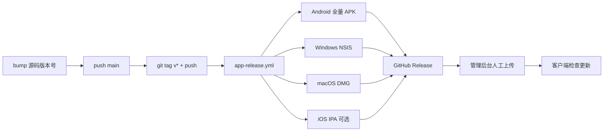

# 客户端 GitHub Actions 发版手册

> **用途**：Tag 触发自动打包、Secrets 清单、版本号怎么加、后台发布注意点。  
> **最后更新**：2026-07-28  
> **Workflow**：[`.github/workflows/app-release.yml`](../../.github/workflows/app-release.yml)  
> **PRD**：[`客户端CI自动发包产品需求.md`](../product/客户端CI自动发包产品需求.md)  
> **Secrets 短表**：[`.github/RELEASE_SECRETS.example.md`](../../.github/RELEASE_SECRETS.example.md)  
> **本机机密备忘（勿提交）**：复制 [`.github/RELEASE_SECRETS.local.example.md`](../../.github/RELEASE_SECRETS.local.example.md) → `.github/RELEASE_SECRETS.local.md`（已 gitignore）

---

## 1. 一句话结论

**不会每次 push 就打包。** 只有把 **`v*` Tag 推到 GitHub** 才会跑 **App Release**，产出 Android / Windows / macOS 安装包（有 Apple Secrets 时再加 iPhone IPA），并挂到 GitHub Release。

```text
改代码 → bump 各端版本号 → merge main → git tag vX.Y.Z → git push origin vX.Y.Z
  → Actions 打包 → Releases 下载 → 管理后台 App 版本管理上传发布
```

---

## 2. 流程总览



| 阶段 | 做什么 | 谁做 |
|------|--------|------|
| 开发 | PR / push → `android-ci` / `tauri-ci`（测试，**不发版**） | CI |
| 改版本 | 改各端 `versionName` / `versionCode` 并 commit 到 `main` | 人 |
| 触发发版 | `git tag` + `git push origin <tag>` | 人 |
| 自动打包 | Actions 并行构建 + 创建 Release | CI |
| 运营发布 | 下载附件 → 后台上传 → 发布 | 人 |

---

## 3. 当前版本对照（SSOT）

> Tag（如 `v3.16.1`）只是**发版列车号**；用户看到的版本以各端源码为准。下表按 **2026-08-02** 核对，发版前以文件为准。

| 端 | 用户可见版本 | 版本码 | 改哪里 |
|----|--------------|--------|--------|
| **Android** | `3.16.1` | `54` | `apps/android/app/build.gradle.kts` → `versionName` / `versionCode` |
| **Windows / macOS** | `1.5.2` | `152` | 三处必须一起改：`apps/tauri/package.json`、`src-tauri/tauri.conf.json`、`src/lib/app-meta.ts`（`APP_VERSION_NAME` / `APP_VERSION_CODE`）；`src-tauri/Cargo.toml` 一并 |
| **iPhone** | `1.0.0` | `1` | `apps/tauri/platforms/ios/project.yml` → `MARKETING_VERSION` / `CURRENT_PROJECT_VERSION` |
| **发版 Tag** | `v3.16.1` | — | 仅 Git Tag，不改客户端逻辑版本 |

Cargo 桌面包版本一般跟 `tauri.conf.json`；若 `src-tauri/Cargo.toml` 有 `version` 字段，发版时一并对齐。

---

## 4. 如何加一个新版本（操作清单）

### 4.1 只发 Android

1. 编辑 `apps/android/app/build.gradle.kts`：
   - `versionCode`：**必须 +1**（如 `44` → `45`）
   - `versionName`：按语义改（如 `3.14` → `3.15`）
2. 确认 `releaseAppBaseUrl` 指向生产控制面（当前写在 gradle，**不是** GitHub Secret）
3. `git commit` → `git push origin main`
4. 打 Tag 并推送（见 §4.4）
5. 下载 `kuayun-android-*-arm64.apk`（约 **49MB**）→ 后台 `platform=android` 上传发布

### 4.2 只发 Windows / macOS（桌面）

1. 同步改三处为同一版本，例如 `1.5.0` / `150` → `1.5.1` / `151`：
   - `apps/tauri/package.json` → `"version"`
   - `apps/tauri/src-tauri/tauri.conf.json` → `"version"`
   - `apps/tauri/src/lib/app-meta.ts` → `APP_VERSION_NAME` / `APP_VERSION_CODE`
2. `APP_VERSION_CODE` **只增不减**（后台 `has_update` 靠它比较）
3. commit → push main → Tag（§4.4）
4. 下载：
   - Windows：`kuayun-windows-*-x64-setup.exe`（约 10–15MB）+ 若有 `.sig`
   - macOS：`kuayun-macos-*.dmg`（约 15–20MB）+ 若有 `.sig`
5. 后台分别选 `windows` / `macos` 上传；**应用内更新**须粘贴对应 `.sig` 全文（见 §7）

### 4.3 Android + 桌面一起发（常见）

1. 两端都 bump（版本号可不同，如 Android `3.15/45`、桌面 `1.5.1/151`）
2. 一次 Tag 触发四端/三端并行构建
3. Release 正文会列出各端版本摘要

### 4.4 打 Tag 触发打包

```bash
# 已在 main，且版本号已 push
git pull origin main
git tag v3.14.7
git push origin v3.14.7
```

| 规则 | 说明 |
|------|------|
| Tag 格式 | 必须以 `v` 开头，如 `v3.14.7`、`v1.0.0-rc1` |
| 触发方式 | **push tag**；只改代码不打 Tag = 不发版 |
| 看进度 | GitHub → Actions → **App Release** |
| 下包 | GitHub → Releases → 对应 Tag 附件 |

不要用已存在的 Tag 名；改错可删远程 Tag 后重打（慎用，已下载用户可能混淆）。

---

## 5. Repository Secrets 清单

配置位置：GitHub → **Settings → Secrets and variables → Actions → Repository secrets**。

> **安全约定**：真实密码 / 私钥 / Base64 **不要写进本仓库任何已跟踪文件**。私有仓库也建议：值只放 GitHub Secrets + 本机文件；需要备忘时写到 **已 gitignore** 的 `.github/RELEASE_SECRETS.local.md`。

### 5.1 总表

| Secret 名 | 是否必填 | 用途 | 本机来源（对照） |
|-----------|----------|------|------------------|
| `ANDROID_KEYSTORE_BASE64` | 条件 | Android keystore 文件 Base64 | `apps/android/keystore/kuayun-release.keystore` |
| `ANDROID_KEYSTORE_PASSWORD` | 条件 | keystore 密码 | `apps/android/keystore.properties` → `storePassword` |
| `ANDROID_KEY_ALIAS` | 条件 | 密钥别名 | `keystore.properties` → `keyAlias`（常为 `key0`） |
| `ANDROID_KEY_PASSWORD` | 条件 | 密钥密码 | `keystore.properties` → `keyPassword` |
| `VITE_API_BASE_URL` | **建议必填** | 桌面正式包 API 根路径（**不含** `/v1`） | 生产 API，如 `http://192.229.87.112:44080/api` |
| `TAURI_SIGNING_PRIVATE_KEY` | 应用内更新必填 | Tauri updater 私钥**全文** | `apps/tauri/.tauri/updater.key` |
| `TAURI_SIGNING_PRIVATE_KEY_PASSWORD` | 同上 | updater 私钥密码 | `apps/tauri/.tauri/updater.key.password` |
| `APPLE_CERTIFICATE_BASE64` | 仅 iOS IPA | Distribution `.p12` Base64 | Apple 开发者导出 |
| `APPLE_CERTIFICATE_PASSWORD` | 仅 iOS | p12 密码 | 导出时设置 |
| `APPLE_PROVISIONING_PROFILE_APP_BASE64` | 仅 iOS | 主 App 描述文件 | `com.kuayun.vpn.app` |
| `APPLE_PROVISIONING_PROFILE_TUNNEL_BASE64` | 仅 iOS | PacketTunnel 描述文件 | `com.kuayun.vpn.tunnel` |
| `APPLE_TEAM_ID` | 仅 iOS | Team ID（10 位） | Apple Developer |
| `KEYCHAIN_PASSWORD` | 仅 iOS | CI 临时钥匙串密码 | 自设强随机串 |
| `IOS_EXPORT_METHOD` | 可选 | `app-store`（默认）或 `ad-hoc` | — |
| `APPLE_SIGNING_IDENTITY` | 可选 | macOS 桌面 Developer ID；空则 ad-hoc | 本机钥匙串 |

### 5.2 Android 签名说明（本仓库现状）

- 私有仓若已跟踪 `apps/android/keystore.properties` + `keystore/kuayun-release.keystore`，CI **优先用仓库内文件**，可不依赖 Android Secrets。
- 仅当仓库内签名缺失，或设置 `ANDROID_FORCE_SECRET_SIGNING=1` 时，才从 Secrets 解码写入。
- **建议仍配置 Android Secrets 作备份**，以免换机/清仓后无法发版。

生成 Base64（PowerShell）：

```powershell
[Convert]::ToBase64String([IO.File]::ReadAllBytes("D:\Code\Go-www\vpn\apps\android\keystore\kuayun-release.keystore")) | Set-Clipboard
```

### 5.3 桌面 API（`VITE_API_BASE_URL`）

- 示例：`http://192.229.87.112:44080/api`（**不要**写成 `.../api/v1`）
- 须与 Android 生产地址同一控制面
- Android 地址在 `build.gradle.kts` 的 `releaseAppBaseUrl`（注意是站点根，再拼 `api/v1/`），改完需重新打 Android 包

### 5.4 应用内更新（Tauri Updater）

| 项 | 路径 / 值 |
|----|-----------|
| 私钥 | `apps/tauri/.tauri/updater.key`（gitignore） |
| 密码 | `apps/tauri/.tauri/updater.key.password` |
| 公钥 | `apps/tauri/.tauri/updater.key.pub` → 已写入 `tauri.conf.json` → `plugins.updater.pubkey` |

复制到 Secrets：

```powershell
Get-Content "D:\Code\Go-www\vpn\apps\tauri\.tauri\updater.key" -Raw | Set-Clipboard
# → Secret: TAURI_SIGNING_PRIVATE_KEY

Get-Content "D:\Code\Go-www\vpn\apps\tauri\.tauri\updater.key.password" -Raw | Set-Clipboard
# → Secret: TAURI_SIGNING_PRIVATE_KEY_PASSWORD
```

| 注意 | 说明 |
|------|------|
| 不要 `-Force` 重生密钥 | 否则已安装客户端公钥对不上，应用内更新永久失败 |
| 未配这两项 | CI 会关掉 `createUpdaterArtifacts`，Release **没有 `.sig`**，后台无法做应用内更新 |
| 已配且成功 | Release 除安装包外应有 `.sig`；后台「Updater 签名」粘贴 `.sig` **全文** |

### 5.5 iOS（当前可跳过）

Apple 相关 Secrets **未配齐**时，iPhone IPA job 自动跳过，**不阻塞** Android / Win / Mac。要打 IPA 再补齐 §5.1 中 Apple 项。

---

## 6. CI 打出来的包长什么样

| 附件 | 正常体积 | 含义 |
|------|----------|------|
| `kuayun-android-{name}-{code}-arm64.apk` | **~49MB** | 全量包（含 `libclash`/`libbridge`） |
| `kuayun-windows-{ver}-x64-setup.exe` | **~10–15MB** | 含 mihomo（NSIS 压缩） |
| `kuayun-macos-{ver}.dmg` | **~15–20MB** | 含 mihomo |
| `*.sig` | 很小 | Updater 签名（需 `TAURI_SIGNING_*`） |
| `kuayun-ios-*.ipa` | — | 仅 Apple Secrets 齐全时 |

异常：Android ~2.5MB、Windows ~3.6MB → 缺内核，**不要分发**（v3.14.4 曾踩坑；v3.14.5+ 已修）。

---

## 7. 管理后台发布

### 7.1 Android

- 平台：`android`
- 版本名 / 版本码：与 APK 一致（如 `3.14` / `44`）
- 上传 APK；**无** Updater 签名字段

### 7.2 Windows / macOS（要应用内更新）

| 字段 | 填什么 |
|------|--------|
| 平台 | `windows` / `macos` |
| 版本名 | 如 `1.5.0` |
| 版本码 | 如 `150`（须 **大于** 用户当前 `APP_VERSION_CODE`） |
| 安装包 | 对应 `.exe` / `.dmg` |
| Updater 签名 | 对应 **`.sig` 文件全文**（不是 SHA256，不是文件名） |

发布后自测：

```text
GET {API}/api/v1/client/version/tauri-manifest?target=darwin-aarch64&current_version=1.4.0
GET {API}/api/v1/client/version/tauri-manifest?target=windows-x86_64&current_version=1.4.0
```

应返回带 `signature` + `url` 的 JSON（非 `{code,data}` 包装）。

### 7.3 只有安装包、没有 `.sig`

- 可手动把 GitHub Release 链接发给用户安装
- 后台若强制填签名，则无法完成「应用内更新」发布 → 先配 §5.4 再打新 Tag

---

## 8. 注意事项（必读）

1. **Tag 才发包**，push main 不会出正式 Release。
2. **版本码只增不减**；同平台后台 `version_code` 不可重复。
3. **桌面三处版本必须一致**，漏改 `app-meta.ts` 会导致 UI/更新判断错乱。
4. **全量包**：CI 已自动 `setup-mihomo-native` / `fetch:mihomo`；勿用瘦包参数发默认渠道。
5. **Updater 密钥一对一生**：私钥进 Secrets，公钥已在客户端；丢失私钥 = 无法再签同系列更新。
6. **macOS 无 Apple 桌面证书时为 ad-hoc 签名**，用户可能需在「隐私与安全性」里允许打开；正式外发再配 Developer ID / 公证。
7. **Android API 不在 Secrets**，改 `releaseAppBaseUrl` 后必须重新打 Tag 才进包。
8. **旧空壳包**（v3.14.4 等）勿再分发；以体积与能否连接为准。
9. 发版后建议更新本手册 §3 版本表，并在 `docs/功能todo.md` 记一笔。

---

## 9. 推荐发版命令（复制即用）

```bash
# —— 1. 已 bump 版本并 push 到 main ——

# —— 2. 可选本地门禁 ——
cd apps/android && bash scripts/release-gate.sh
cd ../tauri && npm test

# —— 3. 打 Tag（改成新号）——
cd ../..
git tag v3.14.7
git push origin v3.14.7

# —— 4. 打开 Actions / Releases 核对体积与 .sig ——
# —— 5. 后台上传并发布 ——
```

---

## 10. 相关文件索引

| 文件 | 说明 |
|------|------|
| `.github/workflows/app-release.yml` | Tag 发版流水线 |
| `.github/workflows/android-ci.yml` / `tauri-ci.yml` | PR 质量门禁（不发版） |
| `.github/RELEASE_SECRETS.example.md` | Secrets 短说明 |
| `.github/RELEASE_SECRETS.local.md` | 本机密文备忘（gitignore，自建） |
| `scripts/ci/setup-android-signing.sh` | Android 签名注入 |
| `scripts/ci/prepare-tauri-release-build.mjs` | 无 updater 密钥时关签名产物 |
| `apps/tauri/跨云客户端打包说明.md` §0.6 / §14 | 本地打包与 Updater 细节 |
| `docs/guides/App-Android-发版检查清单.md` | Android 上架前核对 |
