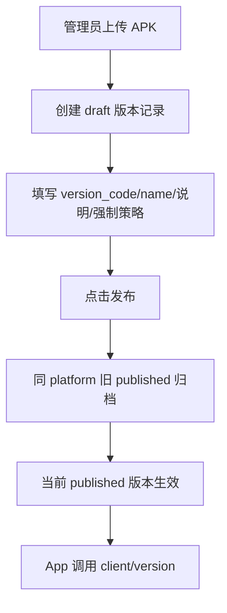
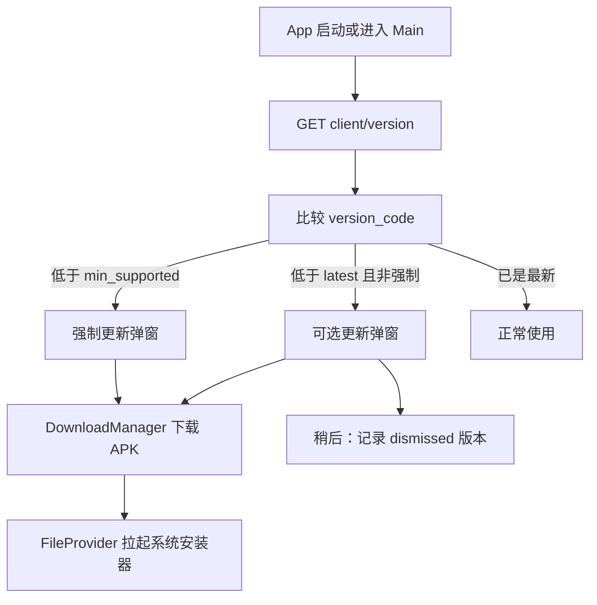

# App 升级管理产品需求文档（PRD）

> **文档状态**：MVP+ 已实现（后台托管 APK + App 检查更新 + 应用内下载/安装引导）
> **适用阶段**：自研 App 运营支撑 — 版本发布与更新提醒  
> **最后更新**：2026-06-07  
> **关联文档**：[自研 App 需求文档](自研App需求文档.md)、[配置管理](../guides/配置管理.md)、[数据库设计](../architecture/数据库设计.md)

---

## 1. 核心结论

**第一版采用「后台托管 APK + 版本元数据管理 + App 启动/前台检查更新 + 应用内下载并拉起安装」**，不引入应用商店、不做静默安装。管理员在后台上传 Android APK、填写 `version_code` / `version_name`、更新说明与是否强制更新，发布后 App 通过公开接口 `GET /api/v1/client/version` 比对本地版本；低于最低支持版本或命中强制策略时展示强制更新提示，存在更高版本时弹出可选更新提醒，用户点击「去更新」后由 DownloadManager 下载并通过 FileProvider 拉起系统安装器。

**不建议复用 `vpn_clients` 表承载自研 App 发版**：该表面向 Clash/Hiddify 等第三方客户端外链目录，缺少 `version_code` 比较、强制更新策略与 APK 托管审计能力。

---

## 2. 背景与问题（SCQA）

### 2.1 情景（Situation）

- Android App MVP 已可注册、充值、连接，版本号写在 `apps/android/app/build.gradle.kts`（`versionCode` / `versionName`）
- 登录/心跳会上报 `app_version`（`user_sessions.app_version`），仅用于运营统计在线设备
- 会员 Web 有第三方客户端下载页（`GET /api/v1/vpn-clients`），用外链 `download_url` 打开，不是自研 App OTA
- About 页仅展示本地 `VERSION_NAME`，**无远程检查更新**

### 2.2 冲突（Complication）

- 发版后用户不知道有新版本，只能人工通知或重新下载安装包
- 出现兼容性问题或安全修复时，无法强制旧版本升级
- 运营无法在后台统一管理 APK、更新说明、发布/下架记录
- 若把 APK 链接塞进 `vpn_clients`，会与第三方客户端目录混淆，且无法表达强制更新规则

### 2.3 疑问（Question）

如何设计一套轻量、可运营的 App 升级能力，让后台能上传发布新版本，App 能自动提醒并引导用户下载？

### 2.4 答案（Answer）

新增独立 **`app_versions`** 数据模型与管理后台「App 版本管理」页面，服务端托管 APK 到 `uploads/apk/`；App 启动、进入主界面或回到前台时调用公开版本检查接口，按 `version_code` 判断强制/可选更新，下载使用系统 DownloadManager，下载完成后拉起系统安装器完成安装。

---

## 3. 现有系统约束（实现前快照；现行版本以 Gradle 为准）

| 能力 | 现状 | 关键文件 |
|------|------|----------|
| 自研 App 版本号 | **现行**：`versionName=3.15`、`versionCode=45`（以 `apps/android/app/build.gradle.kts` 为准；本表原 MVP 占位 `0.1.0-mvp`/`1` 已过时） | `build.gradle.kts`、`DeviceInfoProvider.kt` |
| 版本上报 | 登录/注册/心跳带 `app_version` 字符串 | `pkg/api/dto/app.go`、`user_sessions.app_version` |
| 客户端 API | `GET /api/v1/client/config` 等会员接口 | `internal/api/router/routes/client.go` |
| 版本检查 API | **已实现** `GET /api/v1/client/version`（公开） | `app_version` handler / `client.go` |
| 文件上传 | APK → `uploads/apk/`；充值截图 → `uploads/recharge-proofs/` 等 | 见实现与 `init.sql` |
| 静态文件访问 | `/uploads`、`/api/uploads` 由 API 容器提供 | `internal/api/router/router.go` |
| 发布状态参考 | 公告 `draft` / `published` / `archived` + publish/archive 动作 | `announcement.go`、`admin_announcements.go` |
| 后台 CRUD | App 版本管理页 + VPN 客户端外链配置 | `frontend/admin` |
| 第三方客户端 | `vpn_clients` 表存外链，非 APK 托管 | `internal/model/vpn_client.go` |

**设计约束（必须遵守）**：

1. 自研 App 发版走 **`app_versions`**，不扩展 `vpn_clients` 语义。
2. **版本比较以 `version_code`（整型）为准**，`version_name` 仅用于展示。
3. **检查更新接口应公开**（无需 JWT），否则未登录用户无法收到强制更新提示。
4. MVP+ 下载方式：**应用内 DownloadManager 下载 APK，并通过 FileProvider 拉起系统安装器**；不做静默安装。
5. 同平台（`android`）同一时间仅保留 **一个 `published` 版本**；发布新版本时自动归档旧 published 记录。
6. `version_code` 是升级判断的唯一依据，`version_name` 只用于展示；后台上传/编辑时填写的 `version_code` 必须与 APK 构建配置一致。
7. Schema 变更写入 `migrations/init.sql`，并同步 `architecture/数据库设计.md`。

---

## 4. 产品目标与 KPI

| KPI | MVP 目标 | 说明 |
|-----|----------|------|
| 发版可运营 | 100% | 后台可上传 APK、填写版本信息并发布 |
| 检查更新成功率 | ≥ 99% | App 启动后 3 秒内完成版本检查（正常网络） |
| 强制更新拦截率 | 100% | 低于 `min_supported_version_code` 的旧版无法继续使用主功能 |
| 可选更新触达 | ≥ 80% | 有新版本时，7 日内至少一次弹窗或 Snackbar 提醒 |
| 下载链路可用 | ≥ 95% | 点击「去更新」可打开有效 APK 下载地址 |

---

## 5. 范围定义

### 5.1 MVP（本 PRD）

| 模块 | 包含 | 不包含 |
|------|------|--------|
| 平台 | **Android / Windows / macOS / iOS（iPhone）** | Google Play / App Store 内更新、TestFlight 链接托管 |
| 包管理 | 后台上传 APK / IPA / 桌面安装包、平台 Tab 筛选、发布/下架、下载 | 分片上传、断点续传、病毒扫描 |
| 更新策略 | 强制更新、可选更新 | 灰度发布、按用户分组、按地区分发 |
| App 行为 | 启动/主界面检查、前台 24h 周期检查、弹窗提醒、应用内下载并拉起安装 | 静默下载安装、应用商店内更新 |
| 多架构 | 单 APK 或运营维护单一 arm64 包 | 按 ABI 自动匹配多包（增强版） |
| 终端 | 管理后台 + Android App + 会员 Web 下载页（平台 Tab，每类型仅最新 published；当前平台安装包二维码扫码下载） | — |

### 5.2 增强版（后续）

- 按 ABI（`arm64-v8a` / `armeabi-v7a`）维护多 APK 或统一下载落地页
- 灰度策略、分渠道包管理、应用商店更新链路
- iOS TestFlight / App Store 外链管理（当前为自托管 `.ipa`）
- 灰度发布（按百分比或用户标签）
- 与推送打通：新版本发布主动通知
- 发版 CI 自动写入版本记录

---

## 6. 用户场景

### 6.1 管理员

| 编号 | 场景 | 期望结果 |
|------|------|----------|
| AD-01 | 上传新 APK 并填写版本信息 | 生成 draft 记录，文件可下载校验 |
| AD-02 | 编辑更新说明、勾选强制更新 | 保存后待发布 |
| AD-03 | 点击发布 | 该版本成为当前 published，旧 published 自动 archived |
| AD-04 | 下架错误版本 | 归档后 App 检查接口不再返回该版本 |
| AD-05 | 下载历史 APK | 管理端可下载或复制静态 URL |

### 6.2 会员（Android App）

| 编号 | 场景 | 期望结果 |
|------|------|----------|
| US-01 | 打开 App，服务端有更高可选版本 | 弹出「发现新版本」，可稍后或去更新 |
| US-02 | 当前版本低于最低支持版本 | 弹出强制更新提示；当前阶段保留「稍后」以降低误配置风险，后续可收紧为不可关闭 |
| US-03 | 点击「去更新」 | 弹窗收起，App 使用 DownloadManager 下载 APK，下载完成后拉起系统安装器 |
| US-04 | 用户选择「稍后」 | 当前版本记录为已忽略；同版本 24h 内不重复弹窗（可配置） |
| US-05 | 关于页手动检查更新 | 展示「已是最新」或引导更新（增强版入口，MVP 可选） |

### 6.3 会员（Web 下载页）

| 编号 | 场景 | 期望结果 |
|------|------|----------|
| WEB-01 | 打开 `/download` 且当前平台有 published 版本 | 展示下载按钮与安装包绝对 URL 二维码，扫码可下载 |
| WEB-02 | 当前平台无可用版本 | 展示空状态，不展示二维码 |

---

## 7. 业务流程

### 7.1 发版流程（后台）



### 7.2 检查更新流程（App）



---

## 8. 数据模型

### 8.1 表 `app_versions`（建议）

| 字段 | 类型 | 说明 |
|------|------|------|
| `id` | bigint PK | 主键 |
| `platform` | varchar | `android` / `windows` / `macos` / `ios`（界面文案 iPhone） |
| `version_name` | varchar | 展示用，如 `1.2.0` |
| `version_code` | int | **比较用**，与 Gradle `versionCode` 对齐 |
| `file_name` | varchar | 原始文件名 |
| `file_path` | varchar | 服务器相对路径，如 `uploads/apk/...` |
| `file_size` | bigint | 字节 |
| `sha256` | varchar | 可选，完整性校验 |
| `download_url` | varchar | 对外完整 URL 或相对 `/api/uploads/apk/...` |
| `release_notes` | text | 更新说明 |
| `force_update` | bool | 是否对该版本启用强制（见规则） |
| `min_supported_version_code` | int | 低于此值的客户端必须强制更新 |
| `status` | varchar | `draft` / `published` / `archived` |
| `created_by` | bigint | 管理员 ID |
| `published_at` | timestamptz | 发布时间 |
| `created_at` / `updated_at` | timestamptz | 审计 |

**索引建议**：`(platform, status, version_code DESC)`。

### 8.2 与现有表边界

| 表 | 用途 | 是否复用 |
|----|------|----------|
| `vpn_clients` | 第三方客户端下载目录 | 否 |
| `user_sessions.app_version` | 设备上报字符串 | 仅统计，不驱动发版 |
| `system_settings` | 键值配置 | 可选存全局 `min_version` 兜底，MVP 以 `app_versions` 为准 |

---

## 9. API 设计

### 9.1 App 端（公开，无需 JWT）

**`GET /api/v1/client/version`**

Query 参数：

| 参数 | 必填 | 说明 |
|------|------|------|
| `platform` | 是 | `android` |
| `version_code` | 是 | 客户端当前 `BuildConfig.VERSION_CODE` |
| `version_name` | 否 | 客户端当前 `VERSION_NAME`，便于日志 |

响应 `data` 建议：

```json
{
  "has_update": true,
  "force_update": false,
  "latest_version_name": "1.2.0",
  "latest_version_code": 120,
  "min_supported_version_code": 100,
  "download_url": "https://vpn.example.com/api/uploads/apk/android_120_xxx.apk",
  "sha256": "…",
  "release_notes": "1. 修复充值提醒\n2. 优化连接稳定性"
}
```

**判定规则**：

1. 取 `platform` + `status=published` 的最高 `version_code` 作为 `latest_*`。
2. 若 `client.version_code < min_supported_version_code` → `force_update=true`。
3. 若 `client.version_code < latest_version_code` → `has_update=true`。
4. 无 published 版本时返回 `has_update=false`。

### 9.2 管理端（`/api/v1/admin`，需 AdminAuth + Audit）

| 方法 | 路径 | 说明 |
|------|------|------|
| GET | `/admin/app-versions` | 分页列表；筛选 `platform`、`status` |
| POST | `/admin/app-versions/upload` | multipart `file` + 表单元数据 |
| GET | `/admin/app-versions/:id` | 详情 |
| PUT | `/admin/app-versions/:id` | 编辑 release_notes、force_update、min_supported 等 |
| PUT | `/admin/app-versions/:id/publish` | 发布；同事务归档旧 published |
| PUT | `/admin/app-versions/:id/archive` | 下架 |
| DELETE | `/admin/app-versions/:id` | `draft` / `archived` 可删；删除记录后会尝试删除对应 APK 文件 |
| GET | `/admin/app-versions/:id/download` | 可选；或直接返回静态 URL |

**上传表单字段（建议）**：

| 字段 | 必填 | 说明 |
|------|------|------|
| `file` | 是 | `.apk` / `.ipa` / 桌面包（按平台），大小上限如 200MB |
| `platform` | 是 | `android` / `windows` / `macos` / `ios`，默认 `android` |
| `version_name` | 是 | 与包内信息一致 |
| `version_code` | 是 | 与 Gradle `versionCode` 一致，升级判断仅看该字段；上传时建议默认当前最大值 + 1 |
| `release_notes` | 否 | 更新说明 |
| `force_update` | 否 | 默认 false |
| `min_supported_version_code` | 否 | 默认等于当前 `version_code` 或运营配置 |

---

## 10. 后台页面设计

**入口**：系统管理 → **App 版本管理**（`settings/app-versions` 或独立菜单）

**列表列**：平台、版本名、版本码、文件大小、状态、强制更新、发布时间、操作

**操作**：

- 上传新版本（弹窗：选 APK + 填元数据）
- 编辑（当前灵活版：`draft` / `archived` 可编辑；`published` 不可编辑）
- 发布 / 下架 / 重新发布（`draft` 或 `archived` 可发布；发布后旧 `published` 自动归档）
- 复制下载链接 / 下载 APK
- 删除（`draft` / `archived` 可删除；会先删除 DB 记录，再尝试 `os.Remove(file_path)` 删除 APK 文件。若文件删除失败，接口仍可能返回成功，需要运维定期清理孤儿文件）

**状态操作规则（当前灵活版）**：

| 状态 | 可执行操作 |
|------|------------|
| `draft` | 编辑、发布、删除 |
| `published` | 下架 |
| `archived` | 编辑、重新发布、删除 |

**交互参考**：

- 列表与表单：`frontend/admin/src/views/business/vpn-clients/index.vue`
- 状态机：`frontend/admin/src/views/settings/announcements/index.vue`
- 上传：`frontend/admin/src/views/settings/database/index.vue`

**权限种子（建议）**：

- `menu:app-versions`
- `button:app-version:upload`
- `button:app-version:publish`

---

## 11. Android 实现要点

| 项 | 建议 |
|----|------|
| API | `VpnApi.getClientVersion(platform, versionCode, versionName)` |
| Repository | `checkForUpdate()`，比较 `BuildConfig.VERSION_CODE` |
| 触发时机 | 启动检查；进入 Main 后检查；App 回到前台且距离上次检查超过 24h 时再查 |
| 强制更新 UI | `AlertDialog` 强提示；当前阶段仍提供「稍后」兜底，后续可收紧为不可关闭 |
| 可选更新 UI | `AlertDialog`（稍后 / 去更新）；点「去更新」后立即收起弹窗 |
| 下载与安装 | `DownloadManager` 下载 APK；下载完成后 `BroadcastReceiver` 在主线程通过 FileProvider 拉起系统安装器 |
| 本地记录 | `AppPreferences` 存 `last_dismissed_version_code` |
| 版本常量 | `DeviceInfoProvider` 统一暴露 `versionCode` + `versionName` |

**注意**：

- 当前实现不做静默安装，用户仍需在系统安装器中确认安装；不同 Android 版本可能要求用户开启「允许安装未知来源应用」。
- ABI 拆分（arm64/armv7/x86_64）发版时需明确运营提供哪一架构包，或增强版再做下载页分流。

---

## 12. 安全与运维

| 风险 | 对策 |
|------|------|
| 非 APK 文件上传 | 校验扩展名与 MIME |
| 超大文件超时 | 调大 API `WriteTimeout`、Nginx `client_max_body_size` |
| 篡改下载包 | 记录 `sha256`；App 增强版可校验 |
| 错误发版 | `published` 只能下架；`draft` / `archived` 可编辑、重新发布或删除 |
| 旧版长期不升级 | `min_supported_version_code` + 强制弹窗 |
| 下载链失效 | `download_url` 使用持久化 `uploads` 卷（Docker 挂载） |
| 文件记录不一致 | 删除版本时会尝试删除 APK 文件，但文件删除失败不回滚 DB；需定期巡检 `uploads/apk` 孤儿文件 |

---

## 13. 错误码（建议）

| app_code | 场景 | 提示 |
|----------|------|------|
| `APP_VERSION_NOT_FOUND` | 无可用发布版本 | 检查更新失败，请稍后重试 |
| `APP_VERSION_INVALID_FILE` | 上传非 APK 或超限 | 请上传有效的 APK 文件 |
| `APP_VERSION_CODE_DUPLICATE` | version_code 重复 | 版本号已存在 |
| `APP_VERSION_PUBLISH_CONFLICT` | 发布冲突 | 发布失败，请刷新后重试 |

---

## 14. 验收标准（MVP）

- [x] `app_versions` 表与权限种子已写入 `migrations/init.sql`
- [x] 后台可上传 APK 并创建 draft 记录
- [x] 后台可发布版本，且同平台旧 published 自动归档
- [x] 后台可下架、重新发布归档版本、复制下载链接
- [x] 后台可删除 `draft` / `archived` 版本，并尝试删除对应 APK 文件
- [x] `GET /api/v1/client/version` 无需登录可访问
- [x] 客户端 version_code 低于 latest 时返回 `has_update=true`
- [x] 客户端 version_code 低于 min_supported 时返回 `force_update=true`
- [x] Android 启动后弹出可选/强制更新提醒
- [x] 点击「去更新」后弹窗收起，App 下载 APK 并拉起系统安装器
- [x] 关于页可手动检查更新
- [x] App 回到前台后按 24h 周期检查更新
- [x] 文档目录与自研 App PRD 已关联本需求

---

## 15. 实现分期与关键文件索引

| 阶段 | 内容 |
|------|------|
| P1 | `app_versions` 表 + 后端上传/CRUD/发布 + 静态下载 |
| P2 | 管理后台 App 版本管理页 |
| P3 | Android 检查更新 + 弹窗 + DownloadManager 下载 + 安装引导 |
| P4 | sha256 校验、多 ABI 下载页、灰度发布 |

| 模块 | 路径 |
|------|------|
| 后端模型 | `internal/model/app_version.go` |
| 后端服务 | `internal/service/app_version.go` |
| 管理 Handler | `internal/api/handler/app_version.go` |
| 客户端 Handler | `internal/api/handler/app_version.go` |
| 路由 | `internal/api/router/routes/admin_app_versions.go`、`client.go` |
| 后台页面 | `frontend/admin/src/views/settings/app-versions/index.vue` |
| 后台 API | `frontend/admin/src/api/admin.ts` |
| Android API | `apps/android/.../data/api/VpnApi.kt` |
| Android 检查 | `apps/android/.../MainActivity.kt`、`AboutViewModel.kt` |
| Android 下载/安装 | `apps/android/.../update/AppUpdateInstaller.kt`、`AppUpdateDownloadReceiver.kt` |
| Android 弹窗 | `apps/android/.../ui/components/UpdateDialog.kt` |
| Schema | `migrations/init.sql` |

---

## 16. 修订记录

| 版本 | 日期 | 说明 |
|------|------|------|
| v0.1 | 2026-06-07 | 初稿：后台 APK 托管、版本发布、App 检查更新与浏览器下载 MVP |
| v0.2 | 2026-06-07 | MVP 实现：后端/后台/Android 检查更新链路落地 |
| v0.3 | 2026-06-07 | MVP+：Android 应用内下载与安装引导、关于页手动检查、归档版本重新发布、删除记录时同步尝试删除 APK |
| v0.4 | 2026-07-28 | 平台 Tab（Android/Windows/macOS/iPhone）；支持 `ios` 上传 `.ipa`（`uploads/ios/`）；会员下载页每 Tab 仅展示最新 published |
| v0.5 | 2026-07-31 | 会员下载页展示当前平台安装包二维码（绝对 `download_url`），扫码即可下载安装 |
