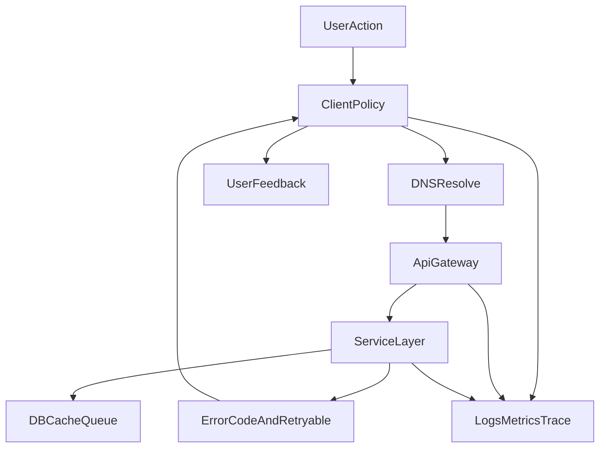

# App 接口稳定性治理需求文档

> **核心结论**：要做到接近商业 VPN 的“接口稳定”，不能只优化登录接口，必须做 **客户端 + 网关 + 后端** 全链路治理：统一错误分级、可重试策略、弱网自愈、幂等与可观测。  
> **适用范围**：Android、Web、Tauri、API 网关、Go 后端服务。  
> **文档状态**：P0/P1 Android 已实施（`AuthRequestSupport`、`ApiRequestSupport`、`retryable`/`trace_id`）；**P2 采样**（`api_error` 遥测 + 后台 `/app-debug/api-stability`）已落地 2026-07-01；全量 SLO 告警待做 — 见 [App成熟化产品路线.md](App成熟化产品路线.md) P1-4  
> **更新日期**：2026-06-29；**修订**：2026-07-01  
> **关联文档**：[自研 App 稳定性评估与优化方案](自研App稳定性评估与优化方案.md)、[客户端弱网与选路优化方案](客户端弱网与选路优化方案.md)、[App隐私保护与连接安全产品需求](App隐私保护与连接安全产品需求.md)

---

## 1. 背景与问题（SCQA）

### 1.1 情景（Situation）

- 当前项目已具备完整会员能力：登录、节点拉取、订阅、充值、订单、会话心跳等。
- 接口层已有 `app_code` 机制，但客户端侧重试、错误提示、降级策略仍存在端差异。
- 用户反馈“有时正常、有时报网络异常”，属于典型全链路稳定性问题。

### 1.2 冲突（Complication）

- 同一问题在不同端表现不一致：有的显示“网络异常”，有的静默失败。
- 弱网、网络切换、VPN 断连与鉴权并发时，容易放大瞬时失败。
- 缺乏统一可观测指标：定位常依赖零散日志，复盘成本高。

### 1.3 疑问（Question）

如何让整套 App 接口体系达到“稳定可用、故障可恢复、问题可定位”的工程标准，并逐步对齐商业 VPN 产品体验？

### 1.4 答案（Answer）

建立统一的 **接口稳定性治理框架**，按 P0/P1/P2 分阶段落地：

1. **P0（核心可用）**：核心链路可重试、可降级、错误可读。
2. **P1（全接口一致）**：统一客户端 HTTP 中间层和后端错误协议。
3. **P2（治理闭环）**：SLO 看板、告警、弱网自动化回归、发布门禁。

---

## 2. 目标与 KPI（量化）

### 2.1 业务目标

- 降低“网络异常”类投诉与重复操作。
- 提高关键链路首次成功率（登录、拉配置、拉节点、提交订单）。
- 缩短故障定位时长（MTTD/MTTR）。

### 2.2 指标目标（首期 4 周）

| 指标 | 当前（估） | 目标 |
|------|------------|------|
| 关键接口首次成功率（FSA） | < 97% | >= 99.0% |
| 登录接口成功率 | < 98% | >= 99.3% |
| 客户端“网络异常”提示占比 | 高 | 下降 40%+ |
| P95 接口耗时（关键接口） | 波动较大 | 下降 20% |
| 故障平均定位时间（MTTD） | > 30 分钟 | <= 10 分钟 |
| 故障平均恢复时间（MTTR） | > 2 小时 | <= 30 分钟 |

说明：上线后以监控实际值替换“当前（估）”。

---

## 3. 稳定性分层架构



---

## 4. 故障分类与统一错误协议

### 4.1 故障分层

1. **网络层**：DNS 失败、TCP 连接失败、超时、TLS 失败、链路阻断。
2. **网关层**：502/503/504、限流 429、上游不可用。
3. **业务层**：4xx 参数/权限/状态错误。
4. **数据层**：数据库抖动、缓存雪崩、队列堆积。

### 4.2 统一错误响应（后端）

在现有 `code/message/app_code` 基础上补充：

- `retryable: boolean`：客户端是否允许自动重试。
- `trace_id: string`：链路追踪与客服排障对齐。
- `suggestion: string`（可选）：给客户端可执行提示。

示例：

```json
{
  "code": 503,
  "message": "service temporarily unavailable",
  "app_code": "UPSTREAM_UNAVAILABLE",
  "retryable": true,
  "trace_id": "8f12d7...",
  "suggestion": "请稍后重试"
}
```

---

## 5. 客户端治理策略（Android/Web/Tauri）

### 5.1 请求策略统一

- **超时基线**：连接超时 15~20s，读取超时 20~30s（按接口分级）。
- **自动重试**（仅幂等接口）：
  - 网络抖动类异常：最多 1~2 次。
  - 退避：`300ms -> 900ms`（带随机抖动）。
- **禁止自动重试**：登录提交、支付提交、写操作（除具备幂等键）。

### 5.2 异常文案分级（替换泛化“网络异常”）

- DNS 失败：无法解析服务器地址，请检查 DNS/网络。
- 连接超时：服务器响应超时，请稍后重试。
- TLS 失败：安全连接失败，请检查系统时间或网络环境。
- 服务不可用（503/504）：服务繁忙，正在恢复，请稍后重试。
- 业务错误：直接展示后端 `app_code` 对应文案。

### 5.3 VPN 场景特殊策略

- 鉴权前断连需避免阻断控制面请求。
- Kill Switch 保护优先，但需为鉴权流程提供安全可达路径（策略白名单或显式释放时机）。
- 网络切换期间延迟关键请求，减少瞬时失败。

### 5.4 离线兜底与降级

- 无网时直接本地 fail-fast（不发请求）。
- 可缓存接口（配置、公告、帮助）支持“最后一次可用数据”。
- UI 必须展示可恢复动作：重试、刷新、联系客服。

---

## 6. 网关与后端治理策略

### 6.1 网关层

- 上游健康检查与剔除。
- 连接池与超时合理化（避免雪崩级联）。
- 429/5xx 标准化输出（含 `retryable`、`trace_id`）。

### 6.2 服务层

- 幂等机制：写接口引入幂等键（订单、支付、充值提示提交等）。
- 关键路径熔断与降级（可读缓存优先）。
- 慢查询治理与热点接口缓存。

### 6.3 数据层

- DB 池参数与慢 SQL 监控。
- Redis 热 key 与过期策略优化。
- 队列积压告警与消费者自愈。

---

## 7. 可观测与排障体系

### 7.1 必要字段

- `trace_id`、`user_id`、`device_id`、`endpoint`、`latency_ms`
- `http_code`、`app_code`、`retryable`、`retry_count`
- `network_type`（wifi/4g/5g）、`vpn_state`、`kill_switch_state`

### 7.2 指标看板

- 端到端成功率（分端、分接口）
- 错误分布（DNS/超时/TLS/5xx/4xx）
- P50/P95/P99 延迟
- 自动重试命中率与重试后成功率

### 7.3 告警阈值（初版）

- 关键接口 5 分钟成功率 < 98.5%
- 503/504 占比 > 2%
- 登录接口超时占比 > 1%

---

## 8. 分阶段实施（P0/P1/P2）

### P0（1~2 周，先稳住）

1. 鉴权断连流程防误阻断（Kill Switch 与登录链路解耦）。
2. 核心接口错误分级与一次安全重试（Android 先行）。
3. 后端返回补充 `retryable`、`trace_id`（关键错误路径先接入）。
4. 登录/拉配置/节点列表/充值核心接口统一文案。

**验收**：
- 关键接口成功率提升到阶段目标。
- “网络异常”泛化提示占比明显下降。

### P1（2~4 周，一致化）

1. Web/Tauri 对齐 Android 的错误分级与重试框架。
2. 后端统一错误码词典与响应规范落地全接口。
3. 网关故障切换策略与健康检查优化。

### P2（持续治理）

1. 稳定性看板 + 告警闭环。
2. 弱网自动化回归（丢包、抖动、断网切换）。
3. 发布门禁：稳定性指标不达标禁止发布。

---

## 9. 风险与边界

- 过度重试会放大流量与后端压力，必须限制重试条件与次数。
- Kill Switch 放行策略需安全评审，避免隐私能力倒退。
- 老客户端兼容：新增字段需保持向后兼容（可选字段）。

---

## 10. 验证与回滚

### 10.1 验证

- 单元测试：错误映射、重试策略、幂等逻辑。
- 集成测试：网关 503、超时、TLS 异常模拟。
- 真机测试：Wi-Fi/4G 切换、VPN 开关并发、弱网环境。

### 10.2 灰度

- 按用户/版本/渠道灰度。
- 先 Android 5%，观察 24h 后扩容。

### 10.3 回滚条件

- 登录成功率下降超过 0.5%。
- 关键接口 5xx 占比连续 15 分钟异常。
- 崩溃率/ANR 明显上升。

---

## 11. 里程碑

| 里程碑 | 时间 | 输出 |
|--------|------|------|
| M1 | T+3 天 | P0 设计评审 + 字段协议冻结 |
| M2 | T+7 天 | Android + 后端 P0 首版上线灰度 |
| M3 | T+14 天 | P0 全量 + P1 开始 |

---

## 12. 附录：接口错误分级矩阵（首版）

| 场景 | 示例 | retryable | 客户端动作 |
|------|------|-----------|------------|
| DNS 失败 | `UnknownHostException` | true | 短退避重试 1 次 + 明确文案 |
| 连接超时 | `SocketTimeoutException` | true | 重试 1 次，失败提示稍后重试 |
| TLS 失败 | `SSLException` | false | 直接提示检查时间/网络环境 |
| 网关 503/504 | `UPSTREAM_UNAVAILABLE` | true | 重试 1 次 + 提示服务繁忙 |
| 业务参数错误 | 400/`INVALID_REQUEST` | false | 直接展示可执行提示 |
| 权限/会话失效 | 401/`SESSION_REVOKED` | false | 跳登录并提示原因；**须触发用户系统通知**（见 [App 用户通知 PRD](App用户通知与消息触达产品需求.md)） |

