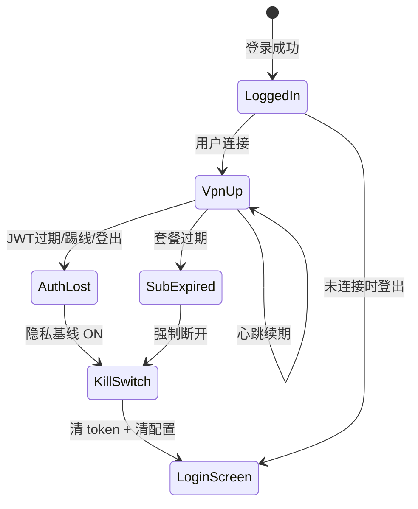

# App 隐私保护与连接安全产品需求（PRD）

> **文档状态**：✅ P0/P1 已落地；隐私引导改为静默基线（2026-07-21）；连接失败阻断默认关（2026-07-22）；数据面 inactive 强制断开（2026-07-23）  
> **关联文档**：[App成熟化产品路线.md](App成熟化产品路线.md)、[自研 App 稳定性评估与优化方案](自研App稳定性评估与优化方案.md)、[客户端弱网与选路优化方案](客户端弱网与选路优化方案.md)  
> **对标产品**：快帆、NordVPN、Mullvad、ExpressVPN、Surfshark  
> **适用端**：Android App（`apps/android`）；Tauri **不对齐** Kill Switch UI（见 [Tauri-Android功能对齐](Tauri-Android功能对齐.md) §2.2）  
> **最后更新**：2026-07-23（§7.4 与现行实现对照）

---

## 1. 核心结论

**跨云 App 应将「防 IP 泄露、断线不裸连、连接可恢复」作为默认体验，而不是让用户去「我的 → 连接稳定性」里逐项开启。** 对标商业 VPN，在 **首次连接前完成隐私基线配置**（Kill Switch、IPv6 防护、重连期阻断、DNS 强制走隧道），在 **「我的 → 连接与隐私」** 集中展示状态与高级项；用户无需理解技术名词即可获得与 NordVPN / Mullvad 同级的基础隐私保护。

### 1.1 量化目标（KPI）

| 指标 | 目标 | 验收方式 |
|------|------|----------|
| 新用户默认隐私项开启率 | **100%**（Kill Switch、IPv6 防护、自动重连、重连期阻断） | 新装 App 首次连接前 prefs 快照 |
| 标准泄露自检通过率（已连接） | **≥ 99%**（出口 IP ≠ 本机 IP、DNS 无本地运营商泄露、IPv6 无裸连） | 内置自检 + `ipleak.net` 对照 |
| 意外断线后 5s 内裸连窗口 | **0 次**（Kill Switch 开启时） | 飞行模式 / 杀进程 / 撤销 VPN 自动化脚本 |
| 重连过程裸连窗口 | **≤ 500ms**（P1 目标；P0 先消除 `releaseKillSwitch` 空窗） | logcat + 抓包 |
| 鉴权失效后裸连窗口 | **0 次**（登出/过期/踢线） | 401 注入测试 + 抓包 |
| 用户手动开启「应用直连/规则直连」占比 | 可统计；开启时须确认风险提示 | 埋点 + 设置页二次确认 |
| 连接页「受保护」状态准确率 | **≥ 98%**（与自检结果一致） | 真机矩阵 20 款 ROM |

### 1.2 商业价值

- 降低「连着 VPN 却暴露国内 IP」导致的流媒体解锁失败、用户投诉与退款。
- 与快帆 / NordVPN 等对齐「开箱即用」，减少客服解释成本。
- 为海外用户与隐私敏感场景提供可审计的产品承诺（非法律意义上的绝对安全，见 §8）。

---

## 2. 背景（SCQA）

### 2.1 情景（Situation）

Android App 已具备 Mihomo 全量 TUN、Kill Switch、自动重连、健康探测、应用直连、规则直连、连接稳定性设置页（`StabilitySettingsScreen`）。稳定性 P0–P3 已落地（见 [稳定性评估与优化方案](自研App稳定性评估与优化方案.md)）。

### 2.2 冲突（Complication）

| 问题 | 现状 | 用户感知 |
|------|------|----------|
| Kill Switch | **默认关闭** | VPN 意外断开 → 真实 IP 立刻暴露 |
| IPv6 | 仅路由 `0.0.0.0/0` | 双栈网络可能 IPv6 裸连 |
| 重连策略 | 自动重连前 `releaseKillSwitch()` | 存在短暂无保护窗口 |
| 连接失败 | `engageKillSwitchOnUnexpected = false` | 连接失败时不阻断，可能误用物理网 |
| 验证策略 | 隧道校验失败仍保持「已连接」 | 用户以为安全，实际代理不可达 |
| 配置分散 | 稳定性在「我的」；直连在「连接设置」 | 用户不知道要开哪些开关 |
| 商业 VPN | 上述能力多为 **默认开启** 或首次引导强制完成 | 体验差距明显 |

### 2.3 疑问（Question）

如何在不牺牲连接成功率的前提下，让跨云 App 达到快帆 / NordVPN / Mullvad 级别的 **默认隐私保护** 与 **生产级稳定性**？

### 2.4 答案（Answer）

采用 **「隐私基线默认开启 + 首次连接引导 + 状态可视化 + 分阶段工程落地」** 四段策略：

1. **改默认值与行为**（P0）：Kill Switch、IPv6 防护、重连期阻断默认 ON；消除重连裸连窗口。  
2. **重组「我的」菜单**（P0）：「连接稳定性」升级为 **「连接与隐私」**，内置保护状态与泄露自检。  
3. **首次连接引导**（P1）：Always-On VPN、电池优化、泄露自检一键完成。  
4. **高级分流可选项**（P1）：应用直连 / 规则直连保留，但默认关闭且须风险提示。

### 2.5 账号与订阅生命周期（补充场景）

用户常忽略的一类风险：**不是「VPN 还在不在」，而是「账号失效后 VPN 如何退出」**。若退出方式不当，会在回登录页的瞬间暴露真实 IP。

#### 2.5.1 跨云现状（代码事实，2026-06-28）

| 触发事件 | 当前行为 | 隐私风险 |
|----------|----------|----------|
| JWT / 登录有效期过期（401） | `SessionAuth` 清 token → `handleSessionExpired` → `vpnController.disconnect()` | ⚠️ **高**：走 `ACTION_DISCONNECT`，视为**用户主动断开**，`releaseKillSwitch()`，**不启用 Kill Switch** |
| 他端登录踢下线（`LOGIN_ON_ANOTHER_DEVICE`） | 同上 | ⚠️ **高** |
| 管理员踢会话（`SESSION_REVOKED`） | 同上 | ⚠️ **高** |
| 用户点击「退出登录」 | `disconnect()` + `logout()` | ⚠️ **高**（同上；商业 VPN 亦断 VPN，但通常配合 Kill Switch） |
| 套餐到期 / 无有效订阅 | 连接前拦截；**已连接时**心跳不校验套餐 | ⚠️ **中**：隧道可能继续用磁盘缓存 `config.yaml`，直至用户重连或拉新配置 |
| 流量用尽 / 订阅禁用 | 拉 `/client/config` 失败时断开；已连接时无主动断开 | ⚠️ **中** |
| 开机自动恢复（`VpnBootReceiver`） | 仅看 `VpnSessionStore` 快照，**不校验** `isLoggedIn` | ⚠️ **高**：未登录也可能尝试 `ACTION_RESTORE` |
| 崩溃后恢复（`VpnCrashRecovery`） | 标记待恢复，**不校验**登录态 | ⚠️ **中** |

关键代码路径：

```text
MainActivity.handleSessionExpired / onLogout
  → vpnController.disconnect()
  → VpnTunnelService.ACTION_DISCONNECT
  → userInitiatedDisconnect = true
  → releaseKillSwitch()
  → sessionStore.clearSnapshot()
  → disconnect()（不 engageKillSwitch）
```

**结论**：账号失效本身不会让「仍连着 VPN 的流量」突然变裸连（隧道在则仍走代理）；真正危险的是 **失效后执行断开的方式**——与「用户点断开」相同，默认 **直接回到物理网络**。

#### 2.5.2 商业 VPN 常见做法

| 场景 | NordVPN / ExpressVPN / Surfshark | Mullvad | 快帆类国内出海 App |
|------|----------------------------------|---------|-------------------|
| 退出登录 | **先断 VPN**；Kill Switch 开则 **断网而非裸连** | 退出/换号 **停止隧道** | 会话失效 **强制回登录** 并断 VPN |
| 订阅过期 | 数分钟内 **停止连接**；提示续费 | 账户余额/时长耗尽 **停服** | 到期 **不可连新线路**；已连多强制断开 |
| 他端踢线 | 本端 **断开 + 登出** | 设备列表踢线 | 同账号挤下线 **立即失效** |
| 未登录 | **不允许** 建立/恢复 VPN | 无账号则无配置 | 未登录 **仅展示登录页** |
| 本地缓存配置 | 登出 **清除** 或加密；避免无授权节点 | 配置与账户绑定 | 一般 **不保留** 失效账号配置 |

共性：**账号权限与 VPN 生命周期绑定**；失效时 **宁可断网（Kill Switch）也不裸连**；**无有效授权则不恢复隧道**。

#### 2.5.3 目标策略（写入本产品）

| 原则 | 说明 |
|------|------|
| **鉴权断开 ≠ 用户断开** | 会话失效、踢线、套餐过期、主动登出统一走 `disconnectForAuth()`，**不得**设 `userInitiatedDisconnect=true` |
| **先阻断再导航** | 鉴权断开时：**先** `engageKillSwitch()`（若隐私基线开启），**再** 清 token、跳登录页 |
| **无登录不连网** | `VpnBootReceiver` / `ACTION_RESTORE` / 崩溃恢复 **必须** `repository.isLoggedIn && 有效订阅` |
| **登出清敏感缓存** | 清除 `files/clash/config.yaml`、VPN 快照、可选清除直连规则（或保留但禁用直至再登录） |
| **套餐状态推送** | 心跳响应增加 `subscription_active`；`false` 时触发鉴权式断开（P1，需后端） |

---

## 3. 商业 VPN 对标（能力矩阵）

| 能力 | 快帆 | NordVPN | Mullvad | ExpressVPN | **跨云现状** | **跨云目标** |
|------|:----:|:-------:|:-------:|:----------:|:------------:|:------------:|
| Kill Switch 默认开 | ✅ | ✅ | ✅ | ✅ | ❌ 默认关 | ✅ 默认开 |
| 断线阻断（非用户主动断开） | ✅ | ✅ | ✅ | ✅ | ⚠️ 可选 | ✅ 默认 |
| IPv6 泄露防护 | ✅ | ✅ | ✅ | ✅ | ❌ | ✅ |
| DNS 泄露防护 | ✅ | ✅ | ✅ | ✅ | ⚠️ 大部分 | ✅ 强制 + 自检 |
| Always-On VPN 引导 | ✅ | ✅ | ✅ | ✅ | ⚠️ 仅跳转系统设置 | ✅ 首次引导 + 状态展示 |
| 阻止无 VPN 联网（Lockdown） | ✅ | ✅ | ✅ | ✅ | ❌ 依赖系统 | ✅ 引导 + 检测 |
| 重连期不裸连 | ✅ | ✅ | ✅ | ✅ | ❌ | ✅ |
| 内置泄露检测 | 部分 | ✅ | ✅ | ✅ | ❌ | ✅ |
| 连接状态「受保护」标识 | ✅ | ✅ | ✅ | ✅ | ⚠️ 仅「已连接」 | ✅ 分级状态 |
| 应用分流 / 直连 | ✅ | ✅ | ✅ | ✅ | ✅ | ✅ 保留 + 风险确认 |
| 自动重连 | ✅ | ✅ | ✅ | ✅ | ✅ 默认开 | ✅ 保持 |
| 开机恢复连接 | 部分 | 部分 | 部分 | 部分 | ⚠️ 默认关 | ⚠️ 默认关，引导可选 |
| **登出/会话失效时断 VPN** | ✅ | ✅ | ✅ | ✅ | ⚠️ 会断 VPN | ✅ 保持 |
| **登出/失效后 Kill Switch** | ✅ | ✅ | ✅ | ✅ | ❌ 视为用户断开 | ✅ 先阻断再回登录 |
| **套餐过期后断开 VPN** | ✅ | ✅ | ✅ | ✅ | ❌ 可能继续用缓存配置 | ✅ 主动断开 + 阻断 |
| **未登录禁止恢复隧道** | ✅ | ✅ | ✅ | ✅ | ❌ 开机可尝试恢复 | ✅ 须校验登录态 |

---

## 4. 产品原则

### 4.1 「零配置隐私」原则

以下能力 **新用户默认开启**，老用户升级后 **一次性迁移为开启**（除非用户曾在旧版显式关闭 Kill Switch，迁移策略见 §6.4）：

| 配置项 | 存储键（现有/新增） | 默认值（现 → 目标） |
|--------|---------------------|---------------------|
| Kill Switch | `kill_switch_enabled` | `false` → **`true`** |
| 断网自动重连 | `auto_reconnect_enabled` | `true` → **`true`** |
| IPv6 防泄露 | `ipv6_leak_protection_enabled`（**新增**） | — → **`true`** |
| 重连期保持阻断 | `reconnect_kill_switch_hold`（**新增**） | — → **`true`** |
| 连接失败时阻断 | `block_on_connect_failure`（**新增**） | — → **`true`** |
| 强制 Mihomo DNS | `force_tunnel_dns`（**新增**） | 逻辑已有 → **固化 + 不可关（普通用户）** |
| 开机自动连接 | `boot_auto_connect_enabled` | `false` → **`false`**（保持；与 Always-On 二选一引导） |
| TUN 栈 | `tun_stack_mode` | `gvisor` → **`gvisor`** |

### 4.2 「宁可断网，不可裸连」原则

在 **Kill Switch 开启**（默认）时：

- 隧道非用户主动断开 → **立即**建立阻断 TUN（`setBlocking(true)` + `0.0.0.0/0` + `::/0`）。
- 自动重连过程中 **不得**先 `releaseKillSwitch()` 再建隧道；应 **隧道就绪后**再切换。
- 连接失败且用户未主动取消 → 保持阻断或进入 Kill Switch，并提示「已阻断网络以防泄露」。

### 4.3 「透明但不吓退」原则

- 连接页展示 **保护状态**：`已保护` / `重连中` / `代理异常` / `未连接`。
- 「应用直连」「规则直连」不删除，但加入 **醒目风险提示** 与开启前确认（见 §5.3）。
- 不提供「绝对安全」法律承诺；文档与 UI 使用 **「防泄露保护」** 而非「100% 匿名」。

---

## 5. 「我的」菜单与页面设计

### 5.1 菜单结构调整

**现结构（「我的」→ 连接设置）：**

| 菜单 | 说明 |
|------|------|
| 应用直连 | 指定 App 不走 VPN |
| 规则直连 | 域名/IP 规则 DIRECT |
| 连接稳定性 | Kill Switch、自动重连等 |

**目标结构：**

| 一级菜单 | 二级/页面 | 说明 |
|----------|-----------|------|
| **连接与隐私**（原「连接稳定性」升级） | 见 §5.2 | 默认项只读展示 + 高级可改 |
| 应用直连 | 不变 | 顶部增加隐私风险横幅 |
| 规则直连 | 不变 | 顶部增加隐私风险横幅 |

「我的」中 **Profile 副标题** 由「自动重连、Kill Switch、开机连接」改为 **「防泄露保护、连接稳定性」**。

### 5.2 「连接与隐私」页面信息架构

页面分 **四个区块**（自上而下）：

#### 区块 A：保护状态（只读，置顶）

| 元素 | 行为 |
|------|------|
| 状态徽章 | `已保护`（绿）/ `保护降级`（橙）/ `未保护`（灰）/ `网络已阻断`（红） |
| 出口 IP | 已连接时展示；与自检结果联动 |
| 上次自检时间 | 「立即检测」按钮 |
| 风险项清单 | 如：IPv6 未覆盖、Always-On 未开、电池优化未豁免、存在应用直连 |

#### 区块 B：核心保护（默认开启，普通用户不可关闭）

| 开关/项 | 默认 | 用户可关？ | 说明 |
|---------|:----:|:----------:|------|
| **Kill Switch** | ON | ❌ P0 不可关；P2 可进「高级」关闭 | 隧道意外断开时阻断全部流量 |
| **IPv6 防泄露** | ON | ❌ | TUN 增加 `::/0` 或等效阻断策略 |
| **DNS 防泄露** | ON | ❌ | 强制走 Mihomo DNS；`append-system-dns: false` |
| **重连期保持阻断** | ON | ❌ | 重连过程不释放 Kill Switch |
| **断网自动重连** | ON | ✅ | 最多 3 次退避（现有策略） |

> **UI 文案示例**：「以下保护默认开启，保障 VPN 断开时不会暴露真实 IP」

#### 区块 C：系统级加固（引导型，非 App 内开关）

| 项 | 默认 | 交互 |
|----|:----:|------|
| **始终开启 VPN（Always-On）** | 未检测 | 显示「未配置 / 已配置」；点击跳转系统 VPN 设置 |
| **阻止未使用 VPN 的连接** | 未检测 | 同上（Android 7+ Lockdown） |
| **忽略电池优化** | 检测状态 | 未豁免时显示按钮「去设置」 |
| **开机自动恢复连接** | OFF | 可开关；与 Always-On 互斥提示 |

#### 区块 D：高级（折叠，默认收起）

| 项 | 默认 | 说明 |
|----|:----:|------|
| TUN 网络栈 | gvisor | 现有能力 |
| 连接失败时阻断网络 | ON | 高级用户可关 |
| Kill Switch 关闭（不推荐） | — | 二次确认 + 勾选「我了解可能泄露真实 IP」 |
| 自动重连次数上限 | 3 | 只读展示或高级可调 |

#### 区块 E：隐私检测（P1）

| 功能 | 说明 |
|------|------|
| **一键泄露检测** | 检测出口 IP、DNS 解析路径、IPv6 可达性 |
| **检测历史** | 最近 5 次结果摘要 |
| **异常时建议** | 如「请开启 Always-On」「请关闭应用直连中的 Netflix」 |

### 5.3 「应用直连 / 规则直连」风险门控

开启任一规则或添加直连 App 前，弹出确认：

> **提示**：直连应用/域名将使用本机真实 IP 访问，**无法隐藏位置**，可能导致流媒体解锁失败或隐私泄露。是否继续？

- 首次添加：必须确认。  
- 「连接与隐私」状态页列出当前所有直连项，标记为 **「已降低保护」**。

---

## 6. 连接页与首次使用流程

### 6.1 连接页保护状态

在连接按钮附近增加 **保护状态条**（非阻断式）：

| VPN 状态 | 探测/代理 | 展示 |
|----------|-----------|------|
| 未连接 | — | 灰：「未保护」 |
| 连接中 | — | 蓝：「正在建立保护…」 |
| 已连接 | 探测 OK | 绿：「已保护 · 出口 IP xx」 |
| 已连接 | 探测失败 | 橙：「代理异常 · 流量已阻断/可能无法上网」 |
| Kill Switch | — | 红：「网络已阻断（防泄露）」 |

### 6.2 首次连接引导（Privacy Onboarding）

**触发**：用户首次点击「连接」且尚未完成引导。

**步骤（可合并为 2–3 屏 BottomSheet）：**

1. **说明**：跨云默认开启防泄露；断开 VPN 时会阻断网络。  
2. **系统 VPN**：引导开启 Always-On + Lockdown（跳转系统设置，返回后检测）。  
3. **电池优化**：建议忽略电池优化（跳转）。  
4. **完成**：自动执行一次泄露自检；通过后允许连接。

**跳过策略**：可跳过系统设置，但状态页持续显示「保护未完整」。

### 6.3 连接后自动自检（轻量）

每次连接成功 **30s 内** 后台执行轻量自检（不阻塞 UI）：

- 出口 IP 与连接前本机 IP 对比（已有 `ExitIpProbe` 可复用）。  
- DNS 查询是否经隧道（向固定测试域名解析）。  
- IPv6 探测（若开启 IPv6 防护）。

失败 → 连接页状态降为「保护降级」+ 可选通知。

### 6.4 老用户迁移策略

| 用户类型 | Kill Switch | 其他新默认 |
|----------|-------------|------------|
| 新安装 | 强制 `true` | 全部新默认 |
| 升级安装，从未改过 Kill Switch | 迁移为 `true` | 新项默认 `true` |
| 升级安装，曾显式关闭 Kill Switch | **保持 `false`**，状态页醒目提示「保护未完整」 | 新项仍默认 `true` |

迁移版本号写入 `privacy_baseline_version`（**新增** prefs）。

---

## 7. 技术需求（Android）

### 7.1 P0 — 默认隐私基线

| 编号 | 需求 | 实现要点 | 涉及模块 |
|------|------|----------|----------|
| P0-1 | Kill Switch 默认 `true` | 改 `AppPreferences` 默认值；迁移逻辑 | `AppPreferences` |
| P0-2 | IPv6 防泄露 | `openTun()` / `engageKillSwitch()` 增加 `addRoute("::", 0)`；或 Mihomo 层 disable IPv6 出站；需真机验证 MIUI/ColorOS | `VpnTunnelService` |
| P0-3 | 重连不释放 Kill Switch | 删除 `scheduleAutoReconnect` 中先 `releaseKillSwitch()`；新隧道 `establish` 成功后再关旧阻断 TUN | `ConnectViewModel`, `VpnTunnelService` |
| P0-4 | 意外断开必阻断 | `onDestroy` / `onRevoke` / 非用户 `disconnect` 统一走 `engageKillSwitch`；连接失败 `catch` 改为 `engageKillSwitchOnUnexpected = true`（可配置） | `VpnTunnelService` |
| P0-5 | 页面升级 | `StabilitySettingsScreen` → `PrivacyAndStabilityScreen`（或保留路由改标题）；区块 A–D UI | UI 层 |
| P0-6 | 直连风险确认 | `AppDirectConnectScreen`、`DirectBypassRuleScreen` 增加确认 Dialog | UI 层 |
| P0-7 | 鉴权式断开 | `ACTION_DISCONNECT_AUTH` + `disconnectForAuth()` | `VpnTunnelService`, `VpnController`, `MainActivity` |
| P0-8 | 会话/登出统一鉴权断开 | 替换 `handleSessionExpired` / `onLogout` 中的普通 `disconnect()` | `MainActivity` |
| P0-9 | 恢复前登录校验 | Boot / Restore / CrashRecovery 检查 `isLoggedIn` | `VpnBootReceiver`, `VpnTunnelService`, `VpnCrashRecovery` |

### 7.2 P1 — 检测与引导

| 编号 | 需求 | 实现要点 |
|------|------|----------|
| P1-1 | 泄露自检服务 | 新建 `PrivacyLeakProbe`：IP / DNS / IPv6 三项 |
| P1-2 | Always-On 检测 | `VpnService.prepare` + `Settings` 反射或文档化检测（各 ROM 差异做 best-effort） |
| P1-3 | 首次连接引导 | `PrivacyOnboardingStore` + BottomSheet 流程 |
| P1-4 | 连接页保护状态条 | `ConnectScreen` + `ConnectViewModel` 聚合状态 |
| P1-5 | 保护降级策略 | 代理持续不可达时：可选 **保持阻断** 或 **提示换节点**（产品默认：保持隧道 + 阻断出站，与 Kill Switch 一致） |
| P1-6 | 登出清除本地配置 | `ClashConfigStore.wipe()` | `AppRepository.logout` |
| P1-7 | 心跳订阅态联动 | 后端 heartbeat 扩展 + 客户端 `force_disconnect` | API + `SessionHeartbeatManager` |
| P1-8 | 切换账号前断开 | 新登录覆盖旧会话前 `disconnectForAuth` | `AuthViewModel` |

### 7.3 P2 — 体验打磨

| 编号 | 需求 | 说明 |
|------|------|------|
| P2-1 | 高级关闭 Kill Switch | 仅折叠区 + 二次确认 |
| P2-2 | 埋点与远程配置 | 保护降级次数、直连开启率、自检失败率 |
| P2-3 | Tauri Kill Switch | **产品不对齐**（桌面 MVP 隐藏 KS；见对齐清单 §2.2） |
| P2-4 | 帮助文档 | 「我的」内链「为什么需要 Always-On」 |

### 7.4 关键代码行为变更摘要（2026-07-23 对照实现）

```text
Kill Switch / 连接失败阻断：
  现行 blockOnConnectFailure 默认 false（基线 v2 迁移关旧用户）；设置中可手动开启。
  连接失败默认不断全机网；开启后才 engage Kill Switch。

自动重连：
  保持 killSwitchActive 策略以设置项为准；用户手动断开不自动重连。

IPv6：
  基线静默开启 IPv6 防护；具体路由策略见 PrivacyBaselineMigrator。

数据面 / 假连：
  现行（2026-07-29 P0-11）：全流量「已保护」须系统 VPN Network 真实出网成功（vpn_network_ok）。
  mixed-port / TUN 字节不得单独放行。出海探海外 204；回国探国内站。
  verify 失败且 dataplane inactive → 立即 disconnectDataplaneInactive（FAILED）。
  其它探针 soft-fail → 可 keep_tunnel + degraded（不再 90s 定时断）。
  UI 主区已连接统一「已保护」，不以 probe 黄条驱动主状态。
  详见 docs/product/连接可信-系统VPN硬门禁产品需求.md。
```

> 历史「目标态」草稿（PROTECTED_DEGRADED / 默认 KS=true）已废弃，以上文现行行为为准。
---

## 8. 非目标与诚实边界

以下 **不在本 PRD 承诺「绝对安全」**：

| 项 | 说明 |
|----|------|
| 端到端加密到目标网站 | VPN 仅改变出口 IP；HTTPS 由目标站负责 |
| 账号/设备指纹反作弊 | Netflix 等不仅看 IP |
| WebRTC 泄露（浏览器内） | 系统 VPN 不覆盖 Chrome WebRTC；需在帮助中说明 |
| 恶意 / 超级权限 App |  root /  hook 可绕过 VPN |
| 100% 无断网 | Kill Switch 本质是 **用断网换隐私** |
| iOS 同期实现 | 本 PRD 仅 Android；iOS 另立文档 |

对外表述统一为：**「在正常使用条件下，提供与主流商业 VPN 同级的防泄露保护」**。

---

## 9. 验收标准

### 9.1 功能验收

| 编号 | 场景 | 预期 |
|------|------|------|
| AC-1 | 新装 App，未进设置 | Kill Switch、IPv6 防护、自动重连均为 ON |
| AC-2 | VPN 已连接 → 飞行模式开再关 | 自动重连；期间无 HTTP 裸连（抓包） |
| AC-3 | VPN 已连接 → 强杀 App 进程 | Kill Switch 阻断；或 Always-On 恢复隧道 |
| AC-4 | 系统撤销 VPN 授权 | Kill Switch 或阻断生效；状态页「未保护」 |
| AC-5 | 双栈 Wi-Fi 下连接 | `ipleak.net` 不显示真实 IPv4/IPv6 |
| AC-6 | 添加应用直连 | 须确认；状态页显示「已降低保护」 |
| AC-7 | 自动重连 | 全程无 `releaseKillSwitch` 裸连窗口（logcat 关键字审计） |
| AC-8 | VPN 已连接 → 模拟 JWT 过期（401） | 鉴权断开 + Kill Switch；无裸连抓包 |
| AC-9 | VPN 已连接 → 他端踢线 | 同上 + 弹窗文案正确 |
| AC-10 | VPN 已连接 → 用户退出登录 | 断 VPN；Kill Switch 默认 ON 时网络阻断 |
| AC-11 | 未登录 + 开机自启快照存在 | **不** 发起 `ACTION_RESTORE` |
| AC-12 | 套餐过期（心跳 `subscription_active=false`） | P1：鉴权断开 + 提示续费 |
| AC-13 | 登出后 | `config.yaml` 已删除或不可用于连接 |
| AC-14 | 切换账号登录 | 旧 VPN 已断，无交叉会话 |

### 9.2 真机矩阵（最低）

| 类型 | 数量 |
|------|------|
| 原生 / Pixel 类 | 1 |
| 小米 HyperOS | 1 |
| 华为 / 荣耀 | 1 |
| OPPO / vivo | 1 |
| 三星 OneUI | 1 |

### 9.3 自动化

| 测试 | 类型 |
|------|------|
| 默认 prefs 快照 | 单元测试 |
| `PrivacyLeakProbe` 解析逻辑 | 单元测试 |
| Kill Switch 状态机 | 单元测试 + 仪器化（可选） |
| 重连不 release KS | 单元测试 mock `VpnTunnelService` |

---

## 10. 实施分期与排期建议

| 阶段 | 范围 | 预估 | 依赖 |
|------|------|------|------|
| **Phase P0** | 默认值 + IPv6 + 重连 KS + 页面重组 + 直连确认 + **鉴权断开 + 恢复校验** | 2–2.5 周 | 无 |
| **Phase P1** | 自检 + 引导 + 连接页状态条 | 1–1.5 周 | P0 |
| **Phase P2** | 埋点 + 高级关闭 + 文档 + Tauri 评估 | 1 周 | P1 |

**建议优先级**：P0-2（IPv6）与 P0-3（重连 KS）> P0-1（默认开）> UI。

---

## 11. 与现有文档关系

| 文档 | 关系 |
|------|------|
| [自研App稳定性评估与优化方案](自研App稳定性评估与优化方案.md) | 稳定性能力已部分实现；本文档补齐 **隐私默认化** 与 **商业对标** |
| [自研App对标快帆功能补齐需求](自研App对标快帆功能补齐需求.md) | 占线/设备管理等于隐私正交；并行 |
| [自研App需求文档](自研App需求文档.md) | 需在 §Kill Switch / 连接 章节引用本文档 |

---

## 12. 附录：名词对照

| 术语 | 含义 |
|------|------|
| Kill Switch | 隧道断开时建立阻断 TUN，DROP 全部流量 |
| Always-On VPN | Android 系统「始终开启的 VPN」 |
| Lockdown | 「阻止未使用 VPN 的连接」 |
| 应用直连 | `addDisallowedApplication`，该 App 不走 TUN |
| 规则直连 | Mihomo `DIRECT` 规则 |
| 保护降级 | 隧道在但代理不可达，或存在直连/系统未加固 |

---

## 13. 扩展风险场景清单

除 §2.2、§2.5 已列问题外，实现与验收时应覆盖以下场景。按 **隐私泄露风险** 与 **产品优先级** 分级。

### 13.1 P0 — 必须处理（直接导致 IP 泄露或越权使用）

| 编号 | 场景 | 现状风险 | 目标行为 |
|------|------|----------|----------|
| R-01 | 登录/JWT 过期时会话失效 | 断 VPN 不阻断 | 鉴权断开 + Kill Switch |
| R-02 | 他端登录踢下线 | 同上 | 同上 + 明确文案 |
| R-03 | 用户主动退出登录 | 断 VPN 不阻断 | 可选：**登出仍保持 Kill Switch 至登录页稳定**（与 Nord 一致） |
| R-04 | 开机/崩溃恢复时未登录 | 可能误恢复隧道 | 校验 `isLoggedIn` + 订阅 |
| R-05 | IPv6 双栈网络 | IPv6 裸连 | `::/0` 或 IPv6 drop |
| R-06 | 重连前 `releaseKillSwitch` | 短暂裸连 | 隧道就绪后切换 |
| R-07 | 连接尚未建立时用户打开浏览器 | 点击连接到 TUN 就绪之间的窗口 | 连接中 UI 禁用「已保护」；可选 `setBlocking(true)` 从 prepare 起生效 |
| R-08 | 系统撤销 VPN 授权（`onRevoke`） | 部分 ROM 不触发 KS | 视为意外断开，强制 KS |

### 13.2 P1 — 应尽快处理（间接泄露、合规或滥用）

| 编号 | 场景 | 说明 | 目标 |
|------|------|------|------|
| R-09 | 套餐到期时 VPN 仍连着 | 缓存配置继续代理 | 心跳/定时拉订阅 → 鉴权断开 |
| R-10 | 流量用尽 / 订阅禁用 | 仅重连时失败 | 服务端心跳下发 `force_disconnect` |
| R-11 | 登出后本地残留 `config.yaml` | 节点凭证泄露风险 | 登出 wipe 配置目录 |
| R-12 | 切换账号登录 | 旧会话 VPN 未停 | 登录新账号前强制 `disconnectForAuth` |
| R-13 | Android 私有 DNS（DoT/DoH） | 与 TUN DNS 冲突 | 文档说明 + 自检项「系统私有 DNS」 |
| R-14 | 多 VPN / 企业 VPN 并存 | 路由冲突 | 连接前检测并警告 |
| R-15 | 应用直连 / 规则直连 | 故意裸连 | 已有风险确认；状态页汇总 |
| R-16 | 记住密码本地存储 | 凭据泄露 ≠ IP 泄露 | 安全说明；可选仅记邮箱 |
| R-17 | 诊断日志含出口 IP/节点 | 日志外泄 | 脱敏；关调试后不上报敏感字段 |

### 13.3 P2 — 告知用户或后续迭代

| 编号 | 场景 | 商业 VPN 做法 | 跨云建议 |
|------|------|---------------|----------|
| R-18 | 浏览器 WebRTC 泄露 | 浏览器扩展 / 帮助文档 | 帮助中心说明，非 App 能单独杜绝 |
| R-19 | 酒店 Wi-Fi 门户 /  captive portal | 连接前检测门户 | 提示先完成门户认证再连 VPN |
| R-20 | 分应用双开 / 工作资料夹 | 部分厂商独立网络栈 | 帮助说明；仪器化抽测主流 ROM |
| R-21 | 弱网下 UI 显示「已连接」代理不可用 | 部分产品改为「未保护」 | 保护降级状态 + 可选阻断 |
| R-22 | SIM 切换 / 漫游 | 重连策略 | 依赖自动重连 + heal；文档说明 |
| R-23 | 长时间后台被 ROM 杀死 | Always-On 恢复 | 强化 Always-On 引导与检测 |
| R-24 | 截屏 / 最近任务预览 | 敏感信息 | 登录页防截屏（可选）；连接页不展示完整 token |

### 13.4 场景关系（鉴权 vs 隧道）



---

## 14. 鉴权生命周期 — 技术需求补充

在 §7 基础上增加：

| 编号 | 需求 | 实现要点 | 阶段 |
|------|------|----------|------|
| P0-7 | **鉴权式断开** `disconnectForAuth()` | 新 action `ACTION_DISCONNECT_AUTH`：`userInitiatedDisconnect=false`；`engageKillSwitch`；再清 snapshot | P0 |
| P0-8 | **统一入口** | `handleSessionExpired`、`onLogout`、套餐失效均调用 `disconnectForAuth` | P0 |
| P0-9 | **恢复前校验** | `VpnBootReceiver`、`tryRestoreAfterProcessDeath`、`VpnCrashRecovery` 增加 `isLoggedIn` | P0 |
| P1-6 | **登出清配置** | `ClashConfigStore.wipe()` on logout / auth invalidate | P1 |
| P1-7 | **心跳订阅态** | 后端 `POST /session/heartbeat` 响应增加 `subscription_active`、`force_disconnect_reason`；客户端处理 | P1 |
| P1-8 | **切换账号** | `AuthViewModel.login` 成功前若已有 token 变更，先 `disconnectForAuth` | P1 |
| P2-5 | **登出后 Kill Switch 策略** | 产品可选：A) 保持阻断直到再次连接；B) 登录成功后 `releaseKillSwitch` | P2 |

### 14.1 用户可见文案（鉴权断开）

| 原因 | 标题 | 说明 |
|------|------|------|
| `token expired` | 登录已过期 | 为保护隐私，已断开 VPN 并暂停网络。请重新登录。 |
| `LOGIN_ON_ANOTHER_DEVICE` | 账号在其他设备登录 | 本机 VPN 已断开。请重新登录。 |
| `SESSION_REVOKED` | 登录状态已失效 | 请重新登录后再次连接。 |
| 用户登出 | 已退出登录 | VPN 已断开。（若 KS 开启：网络已暂停，连接后可恢复） |
| 套餐过期 | 套餐已到期 | VPN 已断开，请续费后重新连接。 |

> **用户通知触达**（系统通知栏、冷启动 Banner、Kill Switch 副标题）详见 [App 用户通知与消息触达产品需求](App用户通知与消息触达产品需求.md)。

---
