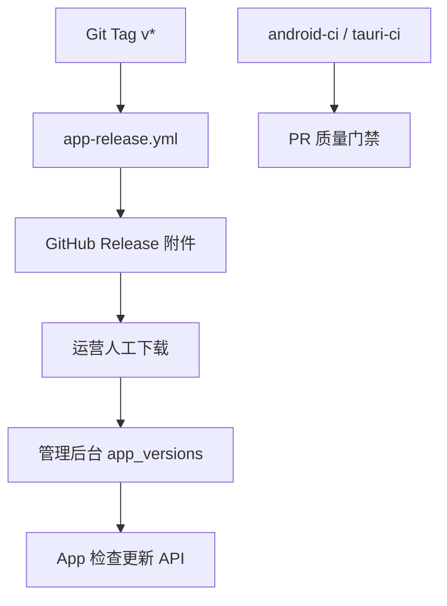

# 客户端 CI 自动发包产品需求（PRD）

> **文档状态**：MVP 已实现（Tag 触发 GitHub Actions + Release 附件）  
> **适用阶段**：Android / Tauri 桌面 / iPhone 四端发版自动化  
> **最后更新**：2026-07-28（v3.14.6 全量包 CI 验证通过；§4.1 门禁与体积参考）  
> **关联文档**：[客户端 GitHub Actions 发版手册](../guides/客户端GitHub-Actions发版.md)（**日常操作以手册为准**）、[App升级管理需求文档](App升级管理需求文档.md)、[App-Android-发版检查清单](../guides/App-Android-发版检查清单.md)、[跨云客户端打包说明](../../apps/tauri/跨云客户端打包说明.md)、[RELEASE_SECRETS.example.md](../../.github/RELEASE_SECRETS.example.md)

---

## 1. 核心结论

**打 Git Tag（`v*`）后，GitHub Actions 自动并行构建 Android APK、Windows NSIS、macOS DMG；若已配置 Apple 签名 Secrets，再额外产出已签名 iPhone IPA，并创建 GitHub Release 作为版本标记与下载入口。** 管理后台 `app_versions` 仍由运营**人工上传** Release 产物发布（MVP 不做 CI 自动写库）。

---

## 2. 背景与问题（SCQA）

### 2.1 情景

- 仓库已有 PR 级 CI：[`android-ci.yml`](../../.github/workflows/android-ci.yml)、[`tauri-ci.yml`](../../.github/workflows/tauri-ci.yml)
- 本地打包脚本齐全，但发版依赖各端开发者本机操作，无统一版本标记与产物归档
- 管理后台已支持 android / windows / macos 安装包托管

### 2.2 冲突

| 问题 | 影响 |
|------|------|
| 无 Tag 发版流水线 | 版本散落、难追溯 |
| Windows CI 缺失 | Tag 发版前无法提前发现 Win 构建失败 |
| iOS 仅 Simulator 构建 | 无法产出真机 IPA |
| 各端版本号独立维护 | Android `3.14/44` 与 Tauri `1.5.0/150` 不同步（Tag 仅作列车号，以源码为准） |

### 2.3 答案

新增 [`app-release.yml`](../../.github/workflows/app-release.yml)：**仅 Tag `v*` 触发**；默认并行构建 Android / Windows / macOS；若 Apple Secrets 齐全再构建 iOS；最后汇总上传 GitHub Release。

---

## 3. 触发规则

| 事件 | 行为 |
|------|------|
| `push tags: v*` | 触发 **App Release** workflow，创建 GitHub Release |
| `push` / `pull_request` | 不触发发版；继续走现有 android-ci / tauri-ci |
| `workflow_dispatch` | 不支持（避免误触正式包） |

**Tag 语义**：发版「列车号」（如 `v3.14.0`）。各端实际 `versionName` / `versionCode` **以源码为准**，Release 正文列出各平台版本摘要。

```text
发版前 bump 版本 → merge main → git tag v3.14.0 → git push origin v3.14.0
```

---

## 4. 产物规格

| 平台 | Runner | 构建命令 | Release 附件命名 |
|------|--------|----------|------------------|
| Android | `ubuntu-latest` | `setup-mihomo-native.sh` → `./gradlew :app:assembleRelease -PreleaseArm64Only=true` | `kuayun-android-{versionName}-{versionCode}-arm64.apk` |
| Windows | `windows-latest` | `npm run fetch:mihomo` → `npm run tauri:win:build` | `kuayun-windows-{version}-x64-setup.exe` + 可选 `.sig` |
| macOS | `macos-latest` | `npm run fetch:mihomo` → `npm run tauri:mac:build` | `kuayun-macos-{version}.dmg` + 可选 `.sig` |
| iPhone | `macos-latest` | `npm run tauri:ios:build:ipa` | `kuayun-ios-{version}.ipa`（Apple Secrets 齐全时） |

- Android 默认 **arm64 全量 APK**（不用瘦包）；CI 构建前拉取 `libclash.so`/`libbridge.so`，产物约 **49MB**，并校验 APK 内含 native 库
- Windows/macOS CI 构建前 **`npm run fetch:mihomo`**，安装包内含 mihomo 二进制，下载即可连接
- Tauri 构建注入 Secret `VITE_API_BASE_URL`（与 Android 生产 API 对齐）
- 配置 `TAURI_SIGNING_*` 时一并上传 updater 签名产物

### 4.1 全量包 CI 门禁（2026-07-28 起）

| 平台 | 构建前 | 构建后校验 | 正常体积参考 |
|------|--------|------------|--------------|
| Android | `bash scripts/setup-mihomo-native.sh` | APK ≥30MB；含 `lib/arm64-v8a/libclash.so`、`libbridge.so` | **~49MB** |
| Windows | `npm run fetch:mihomo` | `mihomo.exe` ≥8MB；`target/release/**/mihomo.exe` 存在；NSIS 安装包 ≥8MB | **~10–15MB**（LZMA 压缩；空壳曾 ~3.6MB） |
| macOS | `npm run fetch:mihomo`（`tauri:mac:build` 内亦会拉取） | `resources/bin/mihomo` 存在 | DMG **~15–20MB** |

> **勿用安装包绝对体积判断 Windows 是否全量**：NSIS 强压缩后 ~13MB 仍可能为全量包；以 **mihomo 二进制是否打入** 为准。  
> **v3.14.4** 曾因 CI 未拉 native/mihomo 产出空壳包（Android ~2.5MB）；**v3.14.5+** 已修复；**v3.14.6** 修正 Windows 体积误杀门禁。

---

## 5. 版本号来源（SSOT 分平台）

| 端 | 文件 | 字段 |
|----|------|------|
| Android | `apps/android/app/build.gradle.kts` | `versionName` / `versionCode` |
| Tauri 桌面 | `apps/tauri/package.json`、`src-tauri/tauri.conf.json`、`src/lib/app-meta.ts` | `version` / `APP_VERSION_CODE` |
| iPhone | `apps/tauri/platforms/ios/project.yml` | `MARKETING_VERSION` / `CURRENT_PROJECT_VERSION` |

发版前须在各端分别 bump，CI 脚本 [`scripts/ci/write-release-versions.sh`](../../scripts/ci/write-release-versions.sh) 读取并写入 Release 正文。

---

## 6. GitHub Secrets

详见 [`.github/RELEASE_SECRETS.example.md`](../../.github/RELEASE_SECRETS.example.md)。摘要：

| Secret | 用途 |
|--------|------|
| `ANDROID_KEYSTORE_BASE64` + 密码/别名 | Android Release 签名 |
| `VITE_API_BASE_URL` | Tauri 生产 API |
| `TAURI_SIGNING_PRIVATE_KEY` / `PASSWORD` | 桌面应用内升级（可选） |
| `APPLE_CERTIFICATE_BASE64` / `PASSWORD` | iOS Distribution 证书（可选，仅 iPhone IPA 需要） |
| `APPLE_PROVISIONING_PROFILE_APP_BASE64` | 主 App 描述文件（可选） |
| `APPLE_PROVISIONING_PROFILE_TUNNEL_BASE64` | PacketTunnel 扩展描述文件（可选） |
| `APPLE_TEAM_ID` | 开发者 Team ID（可选） |
| `KEYCHAIN_PASSWORD` | CI 临时钥匙串密码（可选） |
| `IOS_EXPORT_METHOD` | `app-store`（默认）或 `ad-hoc` |

---

## 7. 发版操作流程

1. 本地 bump 各端版本号并合并到 `main`
2. 跑门禁：
   ```bash
   cd apps/android && bash scripts/release-gate.sh
   cd apps/tauri && npm run preflight:desktop && npm test
   ```
3. `git tag v3.14.6 && git push origin v3.14.6`
4. GitHub → Actions → **App Release** 等待 Android / Windows / macOS job 全绿；若已配置 Apple Secrets，再检查 iOS job
5. GitHub Releases 下载各端包，**核对体积**（见 §4.1）
6. 管理后台 **App 版本管理** 上传 android / windows / macos（iOS 走 TestFlight / App Store 或后续扩展 `ios` 平台）

---

## 8. 验收标准

- [x] 打 Tag `v*` 后 Android / Windows / macOS job 全绿，GitHub Release 自动创建（**v3.14.6** 验证通过）
- [ ] 若配置 Apple Secrets：iOS IPA job 全绿并产出 `.ipa`
- [x] Release 标题 = Tag 名；正文含各端 version、构建 SHA、UTC 时间
- [x] Android APK 为正式 keystore 签名，**全量 arm64 ~49MB**，可覆盖安装、首连无需下载 native
- [x] Windows/macOS 安装包含 mihomo，下载即可连接（Win NSIS 压缩后 ~10–15MB 属正常）
- [ ] iOS IPA 为 Distribution 签名，可上传 TestFlight（`app-store` 导出方式）
- [x] 任一 job 失败时不创建 Release（workflow `needs` 阻断）

---

## 9. 范围外（MVP）

- CI 自动写入 `app_versions` / 自动发布到管理后台
- macOS Notarization（Phase 2：`APPLE_ID` + App 专用密码）
- Linux 桌面包
- 多 ABI Android 分包矩阵
- 每次 push 自动发包（仅 Tag 触发）

---

## 10. 与现有系统关系



- PR CI：测试 + 非正式构建（Android debug 签名）
- Tag CI：正式签名 + Release 附件
- 后台发版：沿用 [App升级管理 PRD](App升级管理需求文档.md)
