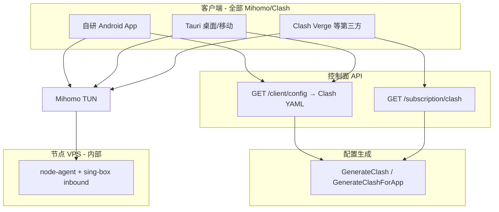

# 自研 App 嵌入 Mihomo 内核产品需求

> **核心结论**：自研 Android / Tauri 客户端 **全面移除 sing-box/libbox**，统一改用 **Mihomo（Clash Meta）内核 + Clash YAML 配置**；`/client/config` 与 `/subscription/clash` **共用同一套生成逻辑**；会员中心 **不再提供 sing-box 订阅**。曼谷对照测试以 Mihomo/Clash 为唯一验收标准（回国 **≥12/13** 国内站）。

| 项 | 内容 |
|----|------|
| 状态 | **已完成**（2026-06-22） |
| 优先级 | **P0** |
| 关联 | [订阅分流产品需求](订阅分流产品需求.md)、[WireGuard中转架构](WireGuard中转架构产品需求.md) |

---

## 1. 背景（SCQA）

### 1.1 情景

- 曼谷实测：**Clash/Mihomo 订阅 `domestic_return` 13/13 国内站稳定**；同链路旧版 sing-box TUN App 仅 2～9/13。
- 根因是 App 用 sing-box JSON 手工仿 Clash DNS/fake-ip，且 libbox 锁定 sing-box 1.10，字段能力边界多。
- 后端曾维护 Clash 与 sing-box 双栈配置生成，长期漂移。

### 1.2 答案（已实施）

**客户端统一 Mihomo + Clash YAML**；删除 sing-box 订阅 API、libbox、双栈 App 配置生成。  
**节点 VPS inbound** 仍由 node-agent 内的 sing-box 进程承载（服务端内部实现，对用户与客户端不可见；后续可单独规划迁移）。

---

## 2. 目标与 KPI

| KPI | 目标 | 验收 |
|-----|------|------|
| 曼谷回国国内站可达 | App Mihomo TUN **≥12/13** | `ssh_debug/test_bangkok_cn_sites.py` |
| 与 Clash 订阅一致性 | 同 user/node/profile 下 server/port/DNS 一致 | Go snapshot 测试 |
| 配置单源 | 无 `GenerateSingBoxForApp`、无 `/subscription/sing-box` | CI 无客户端 sing-box 引用 |
| 包体积 | ABI 拆分可控 | Release 构建 |

---

## 3. 架构（当前）

---

## 4. 已交付清单

### 4.1 后端

- `GenerateClashForApp` + `/client/config` 返回 `format: clash`
- 删除 `GenerateSingBoxForApp`、`/subscription/sing-box`、App sing-box DNS/TUN 构建
- 测试迁移至 Clash YAML 断言

### 4.2 Android

- `mihomo-core` 模块 + `VpnTunnelService`（`Clash.load` + `Clash.startTun`）
- 删除 `libbox`、`SingBoxConfigParser`

### 4.3 Tauri

- 桌面：Mihomo 子进程 `-f config.yaml`
- Android overlay：同 member App，已删除 `libbox` 包

### 4.4 前端

- 会员订阅页：仅 Clash 等有效类型
- Admin：client-runtime 移除 sing-box Tab；协议引导改为 Clash/Mihomo

### 4.5 明确已移除

| 模块 | 说明 |
|------|------|
| `/subscription/sing-box` | API 与会员入口已删 |
| `libbox`（Android / Tauri） | 已删 |
| `GenerateSingBoxForApp` | 已删 |
| 双栈客户端配置维护 | 已删 |

### 4.6 节点侧（未在本 PRD 范围）

node-agent 仍使用 sing-box 生成 **服务端 inbound** 配置（VLESS Reality 等）。这与客户端 Mihomo 不冲突；若需替换为 Xray/Mihomo server，另立「节点 inbound 迁移」需求。

---

## 5. 验收清单

- [x] `go test ./internal/service/...` 通过
- [x] `GET /api/v1/client/config` 返回 `format: "clash"`
- [x] Android Release 不含 `io.nekohasekai.libbox`
- [x] Tauri 桌面使用 Mihomo 子进程
- [ ] 曼谷 App 路径 ≥12/13（待生产回归）
- [x] `docs/功能todo.md` 已更新

---

## 6. 变更记录

| 日期 | 说明 |
|------|------|
| 2026-06-22 | 初稿：全面迁移 Mihomo |
| 2026-06-22 | 完成客户端清理；移除 sing-box 订阅与 libbox；文档同步 |
