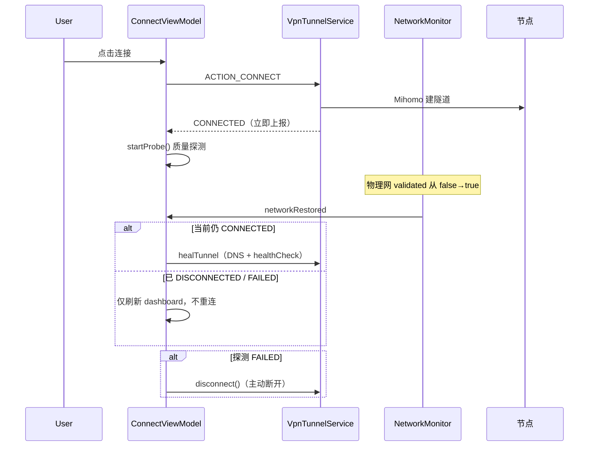

# 自研 App 稳定性评估与优化方案

> **核心结论（2026-07-23）**：P0–P3 稳定性能力已落地；假连路径已改为 **TUN 数据面 inactive 立即断开**（见 [成熟化路线](App成熟化产品路线.md) P0-6）。质量门禁（真机矩阵、崩溃率）仍按 P1 推进。  
> **§1–§3 说明**：以下为 **2026-06-27 优化前** 的差距快照，保留作历史对照；**现行行为以代码 + [功能todo.md](../功能todo.md) + 成熟化路线为准**。  
> **评估日期**：2026-06-27；**文档修订**：2026-07-23  
> **关联文档**：[App成熟化产品路线.md](App成熟化产品路线.md)、[客户端弱网与选路优化方案](客户端弱网与选路优化方案.md)、[自研 App 嵌入 Mihomo 内核产品需求](自研App嵌入Mihomo内核产品需求.md)

---

## 1. 背景与问题（SCQA）

### 1.1 情景（Situation）

- Android App 已迁移至 **Mihomo（CMFA 衍生）** 内核，`VpnTunnelService` 提供 TUN 全量代理
- 控制面已支持 url-test 自动选路、海外弱网 Profile、会员节点过滤、连接质量看板
- 单元测试覆盖配置清理、规则注入、探测结果映射等 **24+** 个 VPN 相关用例（`./gradlew :app:testDebugUnitTest` 通过）

### 1.2 冲突（Complication）

用户在实际使用中关心：

| 用户场景 | 期望 | 当前风险 |
|----------|------|----------|
| 断网后再开网 | 之前连着的 VPN **自动恢复** | 仅 **轻量自愈**（DNS + healthCheck），隧道已断则 **不自动重连** |
| 弱网 / 飞行模式 | 不闪退、有明确提示 | 探测失败会 **主动断开**；Service 与 ViewModel 策略 **不一致** |
| 划掉 App / 系统杀进程 | 回来仍在代理或提示重连 | **无** 连接意图持久化；`START_STICKY` 重启 Service **不恢复隧道** |
| 连不上节点 | 知道原因、能换节点 | 有 `ConnectFailureReason` 文案，但 **无客户端侧故障转移** |
| 换 WiFi / 4G | 无缝继续 | 仅 DNS 同步；**不一定**触发 `healTunnel` |

另：**[客户端弱网与选路优化方案](客户端弱网与选路优化方案.md) 记载「弱网自动重连（最多 2 次）✅」与代码不符**——`VpnTunnelService.autoReconnectAttempts` 仅被置 0，从未递增或触发重连，属文档漂移，以下以代码为准。

### 1.3 疑问（Question）

自研 App 是否已是生产级稳定代理软件？断网重连、闪退、连不上节点等不稳定因素如何处理？与行业产品差距在哪？优化路线是什么？

### 1.4 答案（Answer）

**现阶段定位：可上线的 MVP+，不是生产级「永远在线」VPN。**

- **能做好的**：首次连接、切节点热重载、亮屏/网络恢复时隧道自愈、Release 混淆防护、TUN fd 防 double-close
- **做不好的（待补）**：断线全量自动重连、进程死亡恢复、持续健康检查、Kill Switch、Always-On VPN
- **优化顺序**：P0 统一探测策略 + 真·断线重连 → P1 网络切换强化 + 状态持久化 → P2 周期探测与节点 failover → P3 系统级能力

---

## 2. 代码审查结论（2026-06-27）

### 2.1 自动化测试执行情况

| 测试类型 | 范围 | 结果 |
|----------|------|------|
| 单元测试 `com.vpn.member.vpn.*` | 配置、规则、探测映射、DNS 过滤等 | ✅ 通过 |
| 仪器化测试（真机 VPN） | `VpnTunnelService`、网络切换 | ❌ 无 |
| 弱网模拟（Clumsy / 飞行模式脚本） | 断网重连 E2E | ❌ 未纳入 CI |

**说明**：当前测试验证的是 **配置与逻辑正确性**，不能代替真机断网、杀进程、ROM 后台限制等稳定性验收。

### 2.2 连接生命周期（实测逻辑推演 + 代码路径）



### 2.3 关键场景行为表

| 场景 | 是否自动恢复连接 | 实际行为 | 代码位置 |
|------|:----------------:|----------|----------|
| 用户主动断开 → 再开网 | ❌ | 设计如此，`userInitiatedDisconnect` 阻止 | `ConnectViewModel` |
| VPN 已连接 → 断网 → 恢复 | ⚠️ 部分 | `healTunnel()`，**不** `performConnect` | `onNetworkRestored()` |
| VPN 已断/失败 → 开网 | ❌ | 只刷新 dashboard | 同上 |
| 切节点（已连接） | ✅ | `ACTION_RECONNECT` 热重载 | `VpnTunnelService.reconnect` |
| 改地区/场景（已连接） | ✅ | `shouldAutoReconnect()` + 重连 | `ConnectViewModel` |
| 划掉 App / OOM 杀进程 | ❌ | 隧道丢失；重启后 UI 显示未连接 | 无持久化 |
| Service `START_STICKY` 重启 | ❌ | `intent == null` 时不恢复 | `onStartCommand` |
| 探测失败（弱网抖动） | ❌ 反向断开 | ViewModel 调 `disconnect()` | `startProbe()` |
| Service 层校验失败 | ✅ 保持隧道 | 仅 `VpnDiag.warn` | `verifyTunnelInBackground()` |
| 亮屏 | ⚠️ 自愈 | `MihomoTunnelRecovery.heal` | `MihomoSuspendObserver` |
| WiFi ↔ 4G（两者均 validated） | ⚠️ 不确定 | 可能 **不** 触发 `networkRestored` | `NetworkMonitor` |

### 2.4 稳定性风险分级

| 级别 | 风险 | 用户感知 |
|:----:|------|----------|
| **P0** | 无断线/杀进程后自动重连 | 「断网回来要自己再点连接」 |
| **P0** | 探测失败主动断开（与 Service 宽松策略矛盾） | 「连上了又自己断」 |
| **P0** | 文档宣称弱网重连已实现，代码未实现 | 研发误判、验收漏项 |
| **P1** | 连接状态仅内存（`VpnConnectionBus`） | App 重启后 UI 与真实隧道可能不一致 |
| **P1** | 网络完全丢失无专门处理 | 隧道半死不活直到用户操作 |
| **P1** | WiFi↔蜂窝不一定 heal | 换网后卡顿、需手动重连 |
| **P2** | 息屏 `suspendCore(true)` | 长时间后台可能暂停转发 |
| **P2** | 应用直连/规则变更需重连才生效 | 用户误以为已生效 |
| **P2** | 无周期性健康探测 | 长时间劣化无感知 |
| **P3** | 无 Always-On / Kill Switch / 开机自启 | 与商业 VPN 差距 |
| **P3** | 国产 ROM 电池优化未引导 | 后台被杀概率高 |

### 2.5 已有稳定性措施（值得保留）

| 措施 | 说明 |
|------|------|
| TUN `detachFd()` | 修复 fdsan double-close 闪退 |
| Native 延迟加载 | 避免 Release 启动阶段 SIGABRT |
| ProGuard 保留 JNI / Gson | 历史 Release 连接/登录失败教训 |
| 热重载保 TUN | 切节点尽量不拆隧道 |
| 物理网 DNS 过滤 | 防 TUN DNS 环路 |
| `VpnProtector` 主线程 protect | 适配小米等 ROM |
| App 自身 bypass TUN | mixed-port 探测路径正确 |
| 强制包含本 App 包名直连 | 避免探测走隧道环路 |

---

## 3. 与行业产品对照

### 3.1 商业 VPN（ExpressVPN、NordVPN、Mullvad、快帆等）— P0–P3 落地后剩余差距

| 能力 | 行业常见 | 自研 App 现状（2026-07-01） | 差距 |
|------|:--------:|:---------------------------:|:----:|
| 断网后自动重连 | ✅ | ✅ `VpnSessionStore` + 退避 | 小（真机矩阵待验） |
| Kill Switch | ✅ | ✅ 默认开启 | 小 |
| 「已保护」与数据面一致 | ✅ | 🚧 曼谷场景曾误报；P0 治理中 | **大** |
| 海外回国 DNS/栈 | ✅ | 🚧 App+后端 P0-4 | **大** |
| 7×24 客服 + 崩溃上报全量 | ✅ | 诊断日志（可选） | 中 |
| 真机稳定性 CI | ✅ | adb 脚本，未入 CI | 中 |

### 3.2 代理/机场类客户端（Clash Meta for Android、v2rayNG、Shadowrocket）

| 能力 | CMFA / v2rayNG | 自研 App | 说明 |
|------|----------------|----------|------|
| 内核 | Mihomo | Mihomo（同源） | 对齐 |
| 切配置热重载 | ✅ | ✅ | 已对齐 |
| 断网重连 | CMFA 部分场景自动 | ❌ | 待补 |
| 订阅/配置来源 | 用户导入 URL | 控制面 API | 我们优势 |
| 自动选路 | 订阅 url-test | 控制面 + App | 已对齐 |
| 分应用代理 | ✅ 热更新部分支持 | 需重连 TUN | 我们弱 |
| 用户可自选节点 | ✅ | ✅ | 已对齐 |

### 3.3 定位总结

| 维度 | 评分（5 分制） | 说明 |
|------|:--------------:|------|
| 首次连接成功率 | 4 | 正常网络下链路完整 |
| 断网恢复 | 2 | 无自动重连是最大短板 |
| 弱网容忍 | 3 | 有选路/探测，但探测失败会断开 |
| 进程/后台存活 | 2 | 依赖前台 Service，无恢复 |
| 崩溃防护 | 3.5 | 有针对性修复，无全局 crash 恢复 |
| 可观测性 | 3.5 | VpnDiag + 可选上报 + 后台看板 |
| **综合（生产级代理）** | **≈ 3 / 5** | MVP+，距「商业 VPN 级稳定」差 1～2 个迭代 |

---

## 4. 稳定性优化方案

### 4.1 总原则

1. **用户意图优先**：用户主动断开 ≠ 系统断线，策略分开
2. **Service 与 ViewModel 策略统一**：校验/探测失败是告警还是断开，只定一套
3. **可恢复的状态要持久化**：`EncryptedSharedPreferences` 或 `DataStore`
4. **重连带退避**：指数退避 + 上限次数 + 用户可取消
5. **真机验收纳入发布门禁**：断网脚本 + 主流 ROM 抽测

### 4.2 P0 — 必须做（1～2 周）

| 编号 | 任务 | 实现要点 | 验收标准 |
|:----:|------|----------|----------|
| P0-1 | **真·断线自动重连** | 持久化 `was_connected` + `last_node` + `last_profile`；`networkRestored` 且非用户断开时 `performConnect(reconnect=true)`；实现 `autoReconnectAttempts`（最多 2～3 次，间隔 3s/6s） | 飞行模式关→开，**10s 内自动恢复连接**（3 次内） |
| P0-2 | **统一探测策略** | 方案 A（推荐）：探测失败 **仅告警**（`ProbeStatus.DEGRADED`），不断开；方案 B：探测失败延迟 30s 二次探测后再断开 | 弱网模拟下 **不出现「连上 5 秒又断」** |
| P0-3 | **修正文档漂移** | 更新 [客户端弱网与选路优化方案](客户端弱网与选路优化方案.md) P1-6 状态为「待实现」或随 P0-1 完成 | 文档与代码一致 |
| P0-4 | **ConnectViewModel 单测** | `onNetworkRestored`、`shouldAutoReconnect`、探测失败分支 | 覆盖率 ≥80% 关键分支 |

**P0-1 建议数据结构**（`TokenStore` 或独立 `VpnSessionStore`）：

```kotlin
data class VpnSessionSnapshot(
    val wasUserConnected: Boolean,      // 非用户主动断开前为 true
    val nodeName: String?,
    val region: String?,
    val profile: String,
    val routeMode: String,
    val disconnectedAt: Long?,
)
```

### 4.3 P1 — 强烈建议（2～3 周）

| 编号 | 任务 | 实现要点 | 验收标准 |
|:----:|------|----------|----------|
| P1-1 | **网络切换主动 heal** | `MihomoNetworkObserver.onAvailable` / `onLinkPropertiesChanged` 触发 `healTunnel` 或轻量 `reconnect` | WiFi↔4G 切换后 **30s 内**流量恢复 |
| P1-2 | **Service 重启恢复** | `onStartCommand(null)` 读 `VpnSessionSnapshot`，自动 `ACTION_RECONNECT` | 杀 Service 后 **自动恢复**（同 P0 次数限制） |
| P1-3 | **UI 与隧道状态对齐** | App 冷启动时查询 `VpnService` / `VpnConnectionBus` 同步状态 | 不会出现「通知栏在连、页面显示未连」 |
| P1-4 | **连接超时总闸** | 整段连接流程 30s 超时 + 明确 `ConnectFailureReason` | 不会无限「连接中」 |
| P1-5 | **国产 ROM 后台引导** | 首次连接后检测电池优化 / 自启动，跳转系统设置 | 小米/华为抽测后台 30min 不断 |

### 4.4 P2 — 体验与运营（3～4 周）

| 编号 | 任务 | 说明 |
|:----:|------|------|
| P2-1 | 周期健康探测 | 每 60～120s `ConnectivityProbe`，劣化时 heal 或换节点 |
| P2-2 | 客户端节点 failover | url-test 组延迟持续超阈值时提示换节点或自动切 backup |
| P2-3 | 应用直连 / 规则热更新 | 变更后 `reconnect` 或 TUN 重建，UI 明确「正在应用」 |
| P2-4 | 仪器化测试 | AndroidTest：Mock VPN 权限 + Service 生命周期 |
| P2-5 | 弱网验收 CI | Clumsy 或 adb 断网脚本 + 截图/日志归档 |

### 4.5 P3 — 对标商业 VPN（按需）

| 编号 | 任务 | 说明 |
|:----:|------|------|
| P3-1 | Kill Switch | `setBlocking(true)` 或无隧道时阻断非直连流量 |
| P3-2 | Always-On VPN | 引导用户开启系统 Always-On + 禁止绕过 |
| P3-3 | 开机自启连 | `BOOT_COMPLETED` + 用户开关 |
| P3-4 | 崩溃自动恢复 | `UncaughtExceptionHandler` 记录后尝试重启 Service |
| P3-5 | 多路径 / MPTCP | 长期项，弱网极致优化 |

---

## 5. 真机验收清单（建议每次发版执行）

### 5.1 断网重连（P0 完成后必测）

| # | 步骤 | 期望结果 |
|---|------|----------|
| 1 | 连接成功 → 开飞行模式 10s → 关闭 | **自动重连**或明确提示重连中 |
| 2 | 连接成功 → 关 WiFi（仅 4G）→ 再开 WiFi | 流量恢复，无需手动点连接 |
| 3 | 连接成功 → 强制停止 App → 再打开 | 提示恢复连接或一键恢复 |
| 4 | 用户手动断开 → 开飞行模式再关 | **不**自动重连 |
| 5 | 弱网（限速 1Mbps + 5% 丢包）连接 | 不闪退；探测失败 **不**无故断开（P0-2 后） |

### 5.2 稳定性与闪退

| # | 步骤 | 期望结果 |
|---|------|----------|
| 6 | Release 包连接/断开 20 次 | 无 crash |
| 7 | 连接中旋转屏幕 / 切后台 5min | Service 存活，通知栏状态正确 |
| 8 | 节点故意填错 / 关机 | ≤20s 失败提示，不 ANR |
| 9 | 占线（第二设备连接） | 明确「账号已在其他设备连接」 |

### 5.3 连不上节点

| # | 步骤 | 期望结果 |
|---|------|----------|
| 10 | 选离线节点 | 列表已过滤或连接失败有原因 |
| 11 | 订阅过期 | 连接前拦截，引导续费 |
| 12 | 切换缅甸/新加坡地区 | 节点池与 url-test 符合预期 |

---

## 6. 与现有文档的关系

| 文档 | 需同步项 |
|------|----------|
| [客户端弱网与选路优化方案](客户端弱网与选路优化方案.md) | P1-6「弱网自动重连」标为待实现或随 P0-1 更新 |
| [自研 App 需求文档](自研App需求文档.md) | KPI「崩溃率 ≤0.5%」补充稳定性验收引用本文 §5 |
| [功能todo.md](../功能todo.md) | 新增 App 稳定性优化条目与状态 |

---

## 7. 里程碑与成功指标

| 阶段 | 完成标志 | KPI |
|------|----------|-----|
| **P0 完成** | 断网自动重连 + 探测策略统一 | 断网恢复自动连成功率 ≥90%（真机 10 台抽测） |
| **P1 完成** | 网络切换 + Service 恢复 | WiFi↔4G 切换无感率 ≥85% |
| **P2 完成** | 周期探测 + 仪器化测试入 CI | 弱网场景「连上又断」投诉下降 80% |
| **生产级认定** | P0+P1 完成 + 7 日崩溃率 ≤0.5% | 可对外宣称「生产级稳定」 |

---

## 8. 实现状态（2026-06-27）

| 编号 | 状态 | 实现位置 |
|:----:|:----:|----------|
| P0-1 断线自动重连 | ✅ | `VpnSessionStore`、`ConnectViewModel.scheduleAutoReconnect` |
| P0-2 探测策略统一 | ✅ | `ProbeStatus.DEGRADED`，不再探测失败断开 |
| P1-1 网络切换 heal | ✅ | `MihomoNetworkObserver` → `VpnNetworkEvents` |
| P1-2 Service 重启恢复 | ✅ | `VpnTunnelService.tryRestoreAfterProcessDeath` |
| P1-3 UI 状态对齐 | ✅ | `VpnTunnelStateSync`、`ConnectViewModel.onAppForeground` |
| P1-4 连接 30s 超时 | ✅ | `performConnect` + `withTimeout` |
| P1-5 电池优化引导 | ✅ | `BatteryOptimizationGuide`、稳定性设置页 |
| P2-1 周期健康探测 | ✅ | `startPeriodicHealthProbe`（120s；弱网 DEGRADED 60s） |
| P2-2 节点 failover | ✅ | `NodeFailoverMonitor` + 自动重连 |
| P2-3 配置热更新 | ✅ | `AppEvents.vpnConfigChanged` + 热重载 |
| P2-4 仪器化测试 | ✅ | `VpnSessionStoreInstrumentedTest` |
| P2-5 adb 验收脚本 | ✅ | `apps/android/scripts/vpn-stability-adb-check.sh` |
| P3-1 Kill Switch | ✅ | `VpnTunnelService.engageKillSwitch` |
| P3-2 Always-On 引导 | ✅ | 稳定性设置 → 系统 VPN 设置 |
| P3-3 开机自启连 | ✅ | `VpnBootReceiver` + 用户开关 |
| P3-4 崩溃恢复 | ✅ | `VpnCrashRecovery` |
| P3-5 MPTCP | 📋 | 长期项，未实现 |

---

## 9. 性能优化（2026-06-27）

| 优先级 | 项 | 状态 | 实现要点 |
|:------:|---|:----:|----------|
| 1 | Geo 按需下载 / 首启后台安装 | ✅ | `MihomoGeoAssetManager`；连接 `awaitReady()`；**注册勾选条款 → `acceptPrivacy()`** 后 `scheduleInstall`；已登录老用户启动迁移 |
| 2 | 省电：通知 5s、探测 120s | ✅ | `NOTIFICATION_REFRESH_MS=5000`；`VpnAutoReconnectPolicy` 正常 120s / DEGRADED 60s |
| 3 | system TUN 栈开关 | ✅ | `AppPreferences` + 稳定性设置页 `gvisor` / `system` |
| 4 | 连接耗时埋点 | ✅ | `ConnectTimingTracker`（`connect_click` → `config_dispatched` → `tun_ready`）；KPI P95 &lt; 5s，真机 logcat `connect_timing` |
| 5 | APK 瘦身（geo 分包） | 🚧 | Release `mergeReleaseAssets` 剔除内置 geo；arm64 APK **49MB**（原 ~57MB）；&lt;40MB 需进一步压缩 `libclash.so` 或 Play AAB |

**验收**：`./gradlew :app:testDebugUnitTest :app:assembleRelease`；首装观察 geodata 后台下载；`adb logcat -s connect_timing`。

---

**维护说明**：本文以 `apps/android` 源码为准；内核或连接架构变更后须同步更新 §2 与 §5。
